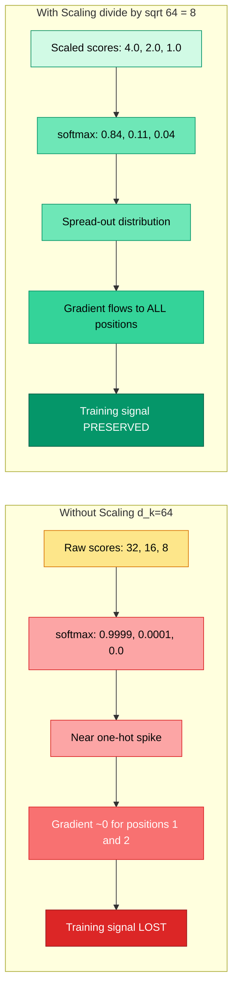
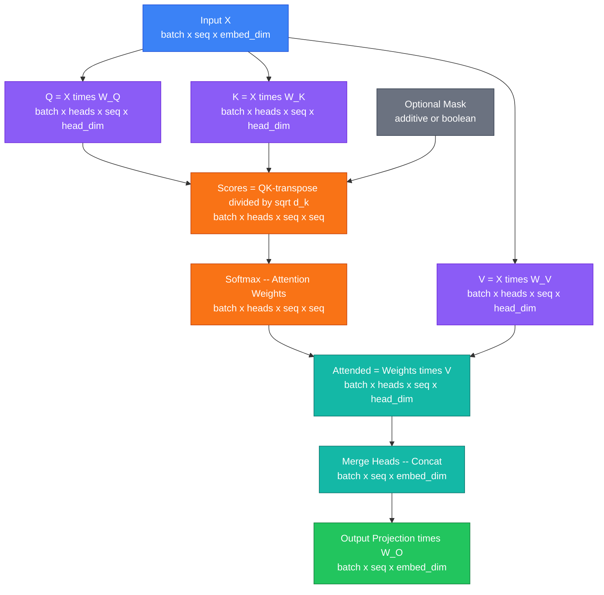
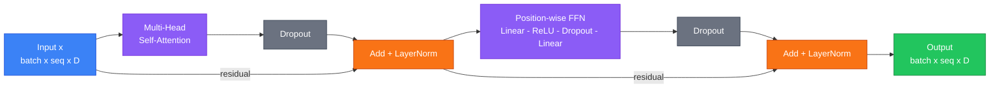
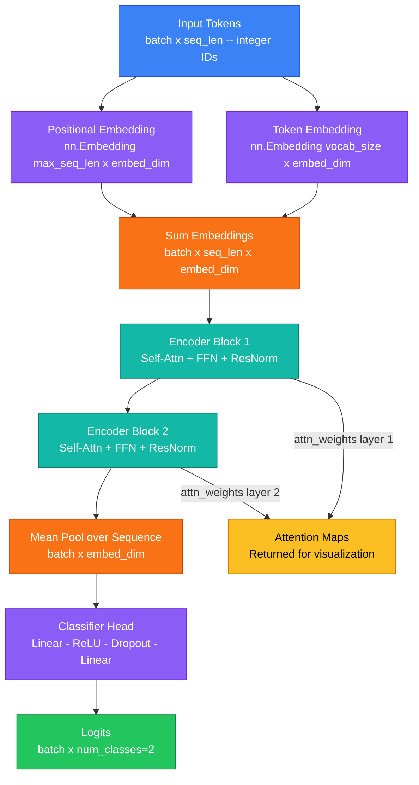
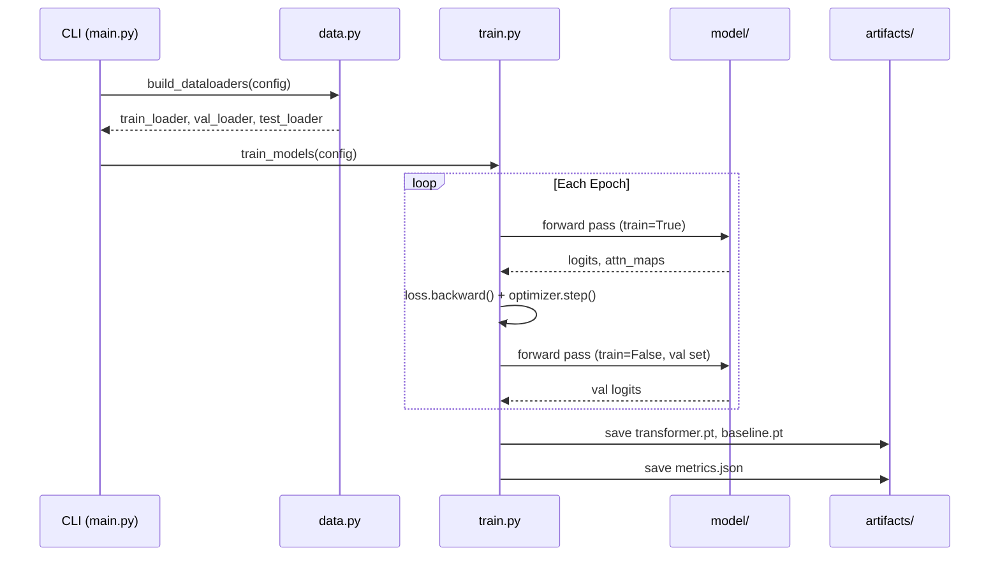
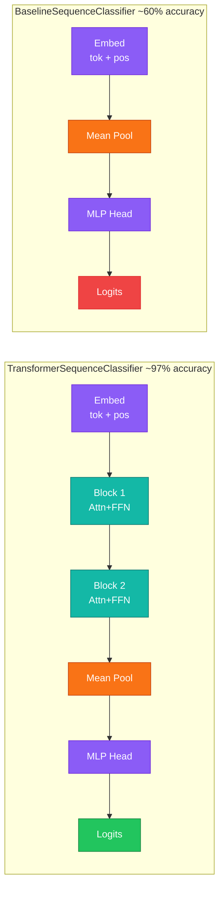
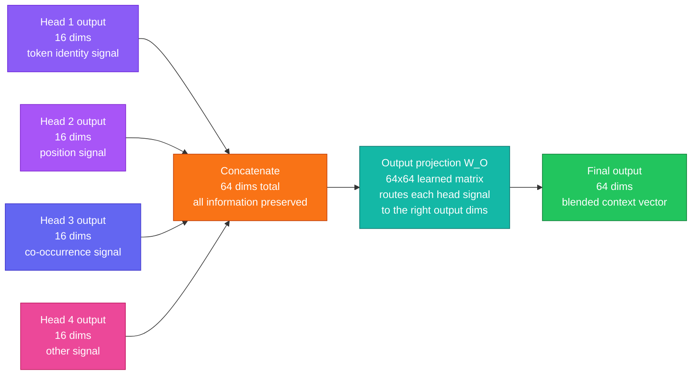
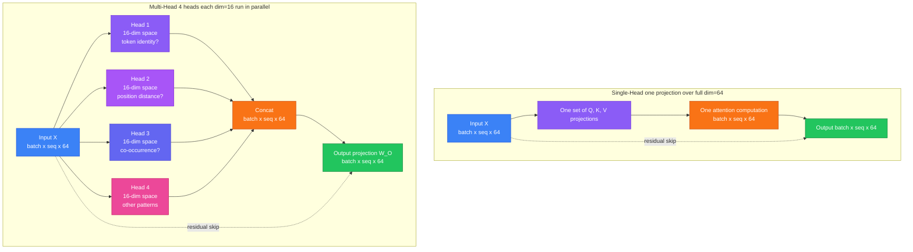
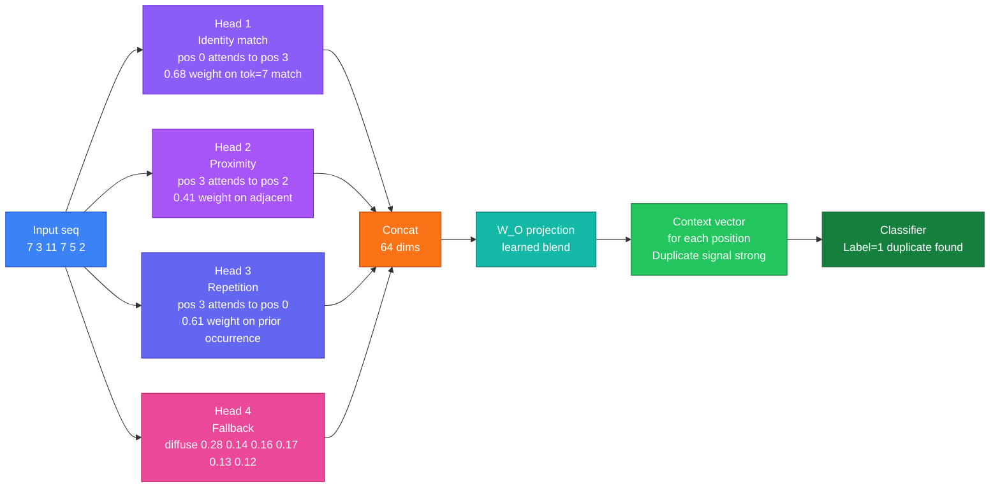
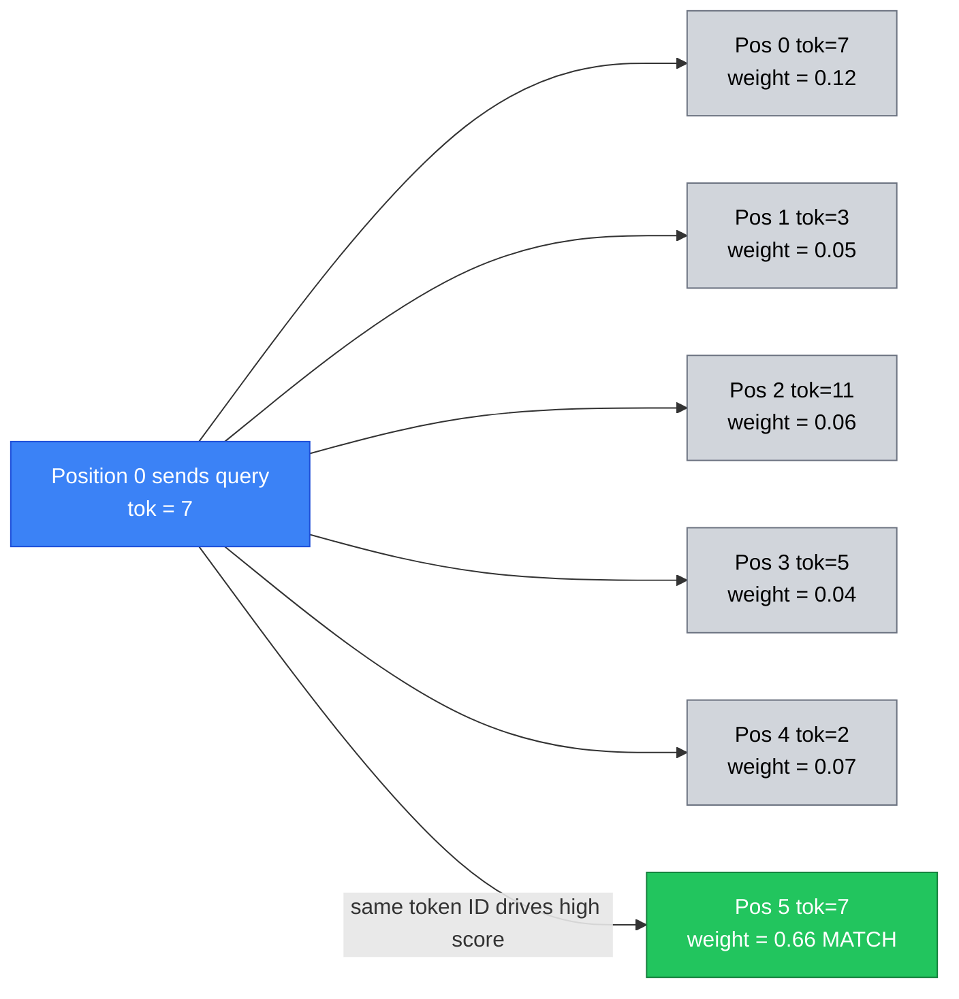

<div align="center">

# Transformer Demo

### Self-Attention and Transformer Encoder Blocks - Built from Scratch in PyTorch

[](https://www.python.org/)
[](https://pytorch.org/)
[](LICENSE)
[](https://github.com/OWNER/REPO/actions)
[](https://github.com/astral-sh/ruff)
[](https://github.com/OWNER/REPO)

</div>

---

## Overview

This project is a **fully runnable, from-scratch implementation** of the Transformer encoder architecture using PyTorch. It was built to make the internals of self-attention and the Transformer block concrete and inspectable rather than hiding them inside framework abstractions. Every component - scaled dot-product attention, multi-head self-attention, the position-wise feed-forward network, residual connections, and layer normalization - is implemented as a plain `nn.Module` and is readable in a few dozen lines of code.

The task chosen to demonstrate the model is **toy sequence classification**: given an integer token sequence of fixed length, the model must predict `1` if the first and last tokens are equal and `0` otherwise. This problem is deliberately designed to require long-range token interaction, which is exactly the strength of self-attention. A baseline MLP model that sees the same tokens but has no attention mechanism is trained alongside the Transformer to make the performance gap visible and measurable.

> [!NOTE]
> This is an educational project. The model sizes are intentionally small so that training completes in seconds on CPU. The architecture choices directly mirror the original "Attention Is All You Need" encoder design (Vaswani et al., 2017).

---

## Table of Contents

- [Why Self-Attention?](#why-self-attention)
- [Architecture Deep Dive](#architecture-deep-dive)
- [Tech Stack](#tech-stack)
- [Project Structure](#project-structure)
- [Setup](#setup)
- [Usage](#usage)
- [Configuration Reference](#configuration-reference)
- [Outputs and Artifacts](#outputs-and-artifacts)
- [Model Comparison](#model-comparison)
- [Notebook Exploration](#notebook-exploration)
- [API Reference](#api-reference)

---

## Why Self-Attention?

Traditional sequence models like RNNs and CNNs process tokens either one at a time or within a fixed local window. This makes it structurally difficult for them to relate tokens that are far apart in a sequence. Self-attention solves this by computing a **direct pairwise relationship score between every token and every other token** in the sequence simultaneously. The result is a weighted mixture of all token representations, where the weights reflect how relevant each other position is when computing the representation for the current position.

> [!NOTE]
> **What does "pairwise score between every token and every other token" mean?**
>
> Take a 5-token sentence: `["The", "cat", "sat", "on", "mat"]`. A *pairwise* score means we compute one score for every possible ordered pair of positions - that is 5 x 5 = 25 scores total. Each score answers one specific question: *"when building token i's new representation, how much should it draw from token j?"*
>
> After softmax, those scores become attention weights (each row sums to 1.0). Here is what a well-trained head might produce on this sentence:
>
> |  | The | cat | sat | on | mat |
> |---|---|---|---|---|---|
> | **The** | 0.05 | **0.60** | 0.10 | 0.05 | 0.20 |
> | **cat** | 0.10 | 0.05 | **0.55** | 0.10 | 0.20 |
> | **sat** | 0.05 | **0.50** | 0.05 | 0.15 | 0.25 |
> | **on** | 0.10 | 0.10 | 0.20 | 0.05 | **0.55** |
> | **mat** | 0.15 | 0.20 | 0.25 | **0.40** | 0.00 |
>
> Reading row by row: "The" attends most to "cat" (its noun), "cat" attends most to "sat" (its verb), "sat" attends most to "cat" (its subject), and "on" attends most to "mat" (its prepositional object). No RNN loop is needed - every token directly reaches every other token in one matrix multiplication. The distances between positions ("The" is 3 positions from "on") are irrelevant; the attention weight is learned from content alone, which is exactly why attention handles long-range dependencies so naturally.

The scaling factor $\frac{1}{\sqrt{d_k}}$ in the attention formula is one of the most important details in the original paper and is easy to overlook. Without it, the dot products between queries and keys grow proportionally to the embedding dimension, and that causes a serious problem during training.

> [!WARNING]
> **Why large dot products break training - a concrete example.**
>
> Imagine `embed_dim = 64` and each Q and K vector has entries drawn from a standard normal distribution. A dot product sums 64 independent multiplications of two random values. The variance of that sum grows linearly with dimensionality: $\text{Var}(q \cdot k) = d_k$, so the standard deviation of raw scores grows as $\sqrt{d_k} = 8$. Scores that look like `[32, 16, 8]` (unscaled) become `[4.0, 2.0, 1.0]` after dividing by $\sqrt{64} = 8$.
>
> Here is what softmax does to those two cases:
>
> | Scores | softmax output | What the model learns |
> |---|---|---|
> | `[32, 16, 8]` | `[0.9999, 0.0001, ~0.0]` | Only position 0 matters, all others ignored |
> | `[4.0, 2.0, 1.0]` | `[0.84, 0.11, 0.04]` | All three positions contribute usefully |
>
> When softmax produces a near-one-hot spike, the gradient of the loss with respect to the attention score inputs is almost exactly zero for all non-maximum positions. This is called **softmax saturation** - the model effectively stops learning from most of the attention weights. Dividing by $\sqrt{d_k}$ keeps scores in a range where softmax stays spread-out and gradients remain non-zero.

> [!NOTE]
> **Why is "only position 0 matters" so harmful, and what happens if you skip softmax entirely?**
>
> **Problem 1 - softmax saturation makes most weights unlearnable.** When unscaled scores produce `softmax([32, 16, 8]) = [0.9999, 0.0001, ~0.0]`, the weights for positions 1 and 2 are frozen near zero. The model cannot learn to pay attention to them even when they contain the correct answer, because the gradient signal that would adjust those weights has vanished. The model is stuck - it has "decided" that position 0 always matters most, and it can barely escape that local minimum.
>
> **Problem 2 - without softmax at all, the weights would be raw unbounded numbers.** Softmax serves two purposes: (1) it normalizes scores into a valid probability distribution that sums to 1.0, and (2) it amplifies the differences between scores in a controlled way. Without softmax, the attention output would just be `scores · V` where scores could be any large positive or negative number. There is no guarantee the output stays in a bounded range, training becomes numerically unstable, and the output cannot be interpreted as a weighted mixture - you lose the elegant "how much do I draw from each token" semantics entirely.
>
> **Problem 3 - why low scores disappear fastest under softmax saturation.** The softmax function is $e^{x_i} / \sum_j e^{x_j}$. When one score is much larger than the others, its exponential dominates the denominator. The exponential grows so fast that a score of 8 vs 32 is not "4x smaller" - it is $e^{-24}$ times smaller, which is essentially zero. So the lowest score does not get "slightly less" attention - it gets attention that rounds to zero to many decimal places. This is why scaling matters: it keeps all scores close enough together that the exponentials stay in a comparable range.



$$\text{Attention}(Q, K, V) = \text{softmax}\!\left(\frac{QK^T}{\sqrt{d_k}}\right)V$$

Multi-head attention repeats this process in parallel across several learned subspaces, allowing the model to jointly attend to information from different representational perspectives at different positions. "Different representational perspectives" means each head gets its own learned Q, K, V projection matrices - so each one learns to look for a fundamentally different type of relationship in the data.

> [!NOTE]
> **What does "different representational perspectives" actually look like? Real examples.**
>
> In large language models trained on real text, researchers have found that individual attention heads specialize in surprisingly concrete tasks. Here are examples of the kinds of roles heads can learn:
>
> | Head role | What it detects | Example |
> |---|---|---|
> | **Syntactic subject-verb** | Which noun is the subject of which verb | "The cat sat" - "cat" and "sat" get high mutual attention |
> | **Coreference** | Which pronoun refers to which noun | "Alice said she..." - "she" attends to "Alice" |
> | **Positional proximity** | Tokens near each other in the sequence | Bigram-style local relationships |
> | **Delimiter tracking** | Commas, periods, brackets | A comma head attends from the clause before to the clause after |
> | **Semantic similarity** | Tokens with similar meaning | Synonyms or related words attend to each other |
> | **Copy/match** | Identical or repeated tokens | A head that fires when two positions hold the same token value |
>
> In **this project specifically**, the model needs to solve "does position 0 equal position 15?" One head will likely specialize in the **copy/match** role - it learns Q and K projections where the same token ID produces a high dot product with itself across any distance. Another head might specialize in positional anchoring ("am I near the start or end of the sequence?"). The other two heads can learn complementary or backup patterns.
>
> This specialization is why removing multi-head and using a single head would hurt performance: a single head's Q and K projections have to simultaneously solve all of these problems, which is a much harder optimization target.

> [!IMPORTANT]
> The task (first token equals last token) is designed so that a model **without** attention cannot reliably solve it after mean-pooling, because averaging destroys positional information. The Transformer can solve it precisely because attention can learn to directly compare position 0 and position $L-1$.

---

## Architecture Deep Dive

### Scaled Dot-Product Attention

The atomic unit of the Transformer is scaled dot-product attention. The query matrix $Q$, key matrix $K$, and value matrix $V$ are all linear projections of the input. Dot products between queries and keys produce a raw score matrix. After scaling and softmax normalization, these scores become attention weights that are used to compute a weighted sum of the value vectors. The result is a new representation for each token that incorporates context from the entire sequence.

> [!NOTE]
> **What are Q, K, and V?** The names come from a database lookup analogy. The **Query** ($Q$) is the question a token is asking: "what information do I need from the rest of the sequence?" The **Key** ($K$) is a label each token broadcasts: "here is what kind of information I hold." The **Value** ($V$) is the actual content a token will contribute if it gets selected. A high dot product between query $i$ and key $j$ means "token $i$'s question matches token $j$'s label," so token $j$'s value flows strongly into token $i$'s new representation. All three - Q, K, V - are separate learned linear transformations of the same input $X$, meaning the model learns what questions to ask, what labels to advertise, and what content to share, all through training.

> [!NOTE]
> **What is an Attention Map?** After the softmax step, the output is a matrix of shape `(seq_len, seq_len)` called the **attention map** or attention weight matrix. Each row $i$ contains a probability distribution over all token positions, showing how much token $i$ "attends to" every other token. A value of `0.9` in row 3, column 0 means: when computing the updated representation for position 3, the model draws 90% of its information from position 0. These maps are what get visualized as heatmaps in `artifacts/attention_heatmap_layer*.png` - bright cells reveal which token pairs the model considers important for the classification decision.



### Transformer Encoder Block

Each encoder block applies self-attention followed by a position-wise feed-forward network (FFN). Both sub-layers use **Pre-LN style** residual connections - a residual skip connection wraps each sub-layer, and layer normalization is applied after the addition. Dropout is applied to the output of each sub-layer before the residual addition, acting as a regularizer.

> [!NOTE]
> **What is an Encoder Block?** An encoder block is a self-contained, reusable processing unit. It takes a sequence of vectors as input and returns an equal-length sequence of vectors as output - the shape never changes. Inside, it does exactly two things in order: (1) multi-head self-attention so every token gathers context from every other token, and (2) a feed-forward network applied independently to each position.
>
> **Concrete walkthrough - one block processing the sentence `["cat", "sat", "mat"]`:**
>
> ```
> Input to Block 1  (3 tokens x 64 dims each):
>   "cat"  → [0.21, -0.55, 1.03, ...]   (64 numbers encoding "cat")
>   "sat"  → [0.88,  0.12, -0.73, ...]  (64 numbers encoding "sat")
>   "mat"  → [-0.44, 0.67,  0.31, ...]  (64 numbers encoding "mat")
>
> After Self-Attention inside Block 1:
>   "cat"  → [0.45, -0.31, 0.91, ...]   (now knows about "sat" and "mat")
>   "sat"  → [0.72,  0.38, -0.50, ...]  (now knows about "cat" and "mat")
>   "mat"  → [-0.20, 0.81,  0.55, ...]  (now knows about "cat" and "sat")
>
> After FFN inside Block 1  (same shape, nonlinearly transformed):
>   "cat"  → [0.61, -0.12, 1.15, ...]   (further enriched)
>   "sat"  → [0.90,  0.55, -0.31, ...]  (further enriched)
>   "mat"  → [-0.10, 0.92,  0.71, ...]  (further enriched)
>
> Output feeds directly into Block 2 as its input.
> ```
>
> The word *encoder* means the block reads and enriches an existing representation - it never generates or predicts new tokens (that is what a *decoder* does). The word *block* is just one complete layer. The *encoder stack* is `num_layers=2` blocks chained end-to-end.

> [!NOTE]
> **What is a Feed-Forward Network (FFN)?** The FFN in this project is a small two-layer MLP: `Linear(64→128) → ReLU → Dropout → Linear(128→64)`. It is applied identically and independently to each token position - the same weight matrix is reused for every position, which is why it is called *position-wise*. Its purpose is to add nonlinear transformation capacity after the attention step. Attention is fundamentally a weighted average (a linear operation), so without the FFN, stacking more blocks would collapse into a single linear transform. The FFN is where the model learns to transform and store token-specific features.

> [!NOTE]
> **What is ReLU?** ReLU stands for Rectified Linear Unit. It is the activation function `f(x) = max(0, x)` - positive values pass through unchanged, negative values become zero. It is placed between the two linear layers of the FFN to introduce nonlinearity. Without it, two linear layers collapse into one linear layer and the network could only learn linear transformations.
>
> **Concrete numerical example:**
>
> ```
> Input to FFN for one token:  [-1.2,  3.4,  0.0, -0.5,  2.1]
>
> After Linear(64→128):
>   hidden = [-2.1,  1.8, -0.3,  4.2, -1.5, ...]
>
> After ReLU  max(0, x):
>   hidden = [ 0.0,  1.8,  0.0,  4.2,  0.0, ...]
>   (all negative values become 0 - the neuron "did not fire")
>
> After Linear(128→64):
>   output = [new enriched 64-dim representation]
> ```
>
> The neurons that output zero are said to be "dead" for that input - they contribute nothing. This is intentional: the network learns which features to activate for which inputs. Neurons that are dead for irrelevant features simply pass no signal, creating a sparse, efficient representation. ReLU avoids the vanishing gradient problem that affected sigmoid/tanh, which saturate near 0 or 1 and produce gradients close to zero even for inputs far from their operating range.

> [!NOTE]
> **What is Dropout?** Dropout is a regularization technique that prevents overfitting by randomly zeroing out activations during training. With `--dropout 0.1`, exactly 10% of outputs are zeroed at random on every forward pass. Each batch sees a different random mask, so the network cannot memorize any single path through the weights.
>
> **Concrete example - before and after dropout (p=0.1, training mode):**
>
> ```
> Attention output for one token (16 values shown):
>   Before: [0.82, -0.31, 1.20,  0.05, -0.77, 0.44, 1.03, -0.12,
>             0.66,  0.38, -0.90, 0.71,  0.23, -0.55, 0.88,  0.14]
>
>   Dropout mask (1=keep, 0=zero, ~10% zeroed):
>            [  1,    1,    1,    1,    0,    1,    1,    1,
>               1,    0,    1,    1,    1,    1,    1,    1  ]
>
>   After:  [0.82, -0.31, 1.20,  0.05,  0.00, 0.44, 1.03, -0.12,
>             0.66,  0.00, -0.90, 0.71,  0.23, -0.55, 0.88,  0.14]
>            (positions 4 and 9 zeroed this batch - different positions next batch)
> ```
>
> Because the zeroed positions are random and change every batch, the network learns to distribute information redundantly rather than routing everything through a small number of high-weight paths. During evaluation, `model.eval()` disables dropout and all activations are live. The outputs are also rescaled by `1/(1-p)` during training so that the expected value of each activation remains the same at inference time.



### Full Model Forward Pass

The complete `TransformerSequenceClassifier` stacks two encoder blocks. Token IDs and their positions are each embedded and summed to produce the initial representation. After the encoder stack, mean pooling collapses the sequence dimension, and a small two-layer MLP head maps the pooled vector to class logits.

> [!NOTE]
> **What is a Token ID?** A token is the basic unit of input to the model. In real NLP systems a token might be a word or sub-word piece; in this project tokens are simply integers sampled from `[0, vocab_size)`. A **Token ID** is the integer that identifies which vocabulary entry a position holds - for example, token ID `7` might represent the word "cat" in a real vocabulary, or just abstract symbol 7 in this toy task. The model converts token IDs into dense floating-point vectors through an embedding lookup table (`nn.Embedding`), which maps each integer to a unique learned 64-dimensional vector. The same token ID always maps to the same vector, regardless of where in the sequence it appears - that is why the positional embedding is added on top, to inject position information.

> [!NOTE]
> **Encoder Block vs Encoder Stack:** A single **encoder block** is one processing layer (attention + FFN + residual + norm). The **encoder stack** (set by `--num-layers`) is multiple blocks wired sequentially. Block 2 receives the enriched output of Block 1 as its input and can build higher-level abstractions on top of it. Early blocks tend to learn surface-level token interactions; later blocks can learn more abstract compositional patterns. In this project the stack depth is 2, which is minimal but sufficient for the toy classification task.

> [!NOTE]
> **What is Mean Pooling?** After the encoder stack, we have a tensor of shape `(batch, seq_len, embed_dim)` - one 64-dimensional vector for each of the 16 token positions. To classify the whole sequence with a single label, we need one vector. Mean pooling computes the arithmetic mean across the sequence dimension, producing `(batch, embed_dim)`. It is the simplest possible aggregation: take every token's representation and average them. The critical limitation is that mean pooling is permutation-invariant - it cannot tell you where in the sequence a pattern occurred, only that it occurred somewhere. This is why the baseline model (which also uses mean pooling but lacks attention) cannot reliably solve the first-equals-last task: after averaging, all positional information is gone.



### Training Pipeline

Both the Transformer and the Baseline are trained using the same data splits, optimizer family, and loss function so the comparison is apples-to-apples. Each epoch runs a full pass over the training set with gradient updates, followed by a validation pass in `torch.no_grad()` context. Metrics are collected per epoch and persisted at the end.



### Comparison Architecture

The baseline model uses the same token and positional embedding as the Transformer, but replaces the encoder stack with a direct MLP applied to the mean-pooled embedding. This is equivalent to a bag-of-embeddings model. It cannot learn positional structure and cannot directly compare distant tokens, which is why it systematically underperforms on the first-equals-last task.



> [!TIP]
> Open `notebooks/attention_exploration.ipynb` after training to interactively inspect which token pairs receive high attention weights across both layers and all four heads. You will see that the model learns to allocate attention to position 0 and position $L-1$ to solve the task.

### Single-Head vs Multi-Head Attention

Single-head attention runs the scaled dot-product attention once over the full `embed_dim=64` space. Multi-head attention splits that space into `num_heads=4` smaller subspaces of size `head_dim = 64 / 4 = 16`, runs attention independently in each subspace, and concatenates the four results back to 64 dimensions before a final linear projection. Each head has its own learned Q, K, V projection matrices, so each head can specialize in discovering a different kind of token relationship.

> [!NOTE]
> **Single-head vs Multi-head - why does it matter?** A single attention head must simultaneously represent all types of relationships a token has with others using one shared set of projections. Multi-head attention gives each head its own independent projections, so Head 1 might learn to match token values (exactly what this task needs), Head 2 might track positional proximity, Head 3 might detect repetition, and Head 4 might learn a fallback catch-all pattern. The heads run in parallel and are cheap because each one works in a smaller `head_dim`-dimensional space rather than the full `embed_dim` space.

> [!NOTE]
> **How do the heads "vote" on context - how does the output get combined?**
>
> The heads do not vote like a committee where the majority wins. Instead they **contribute different information to different dimensions of the same output vector**, and a learned linear layer decides how to weight and blend those contributions. Here is the exact mechanism step by step:
>
> **Step 1 - Each head produces its own attended output independently.**
> Every head runs its own scaled dot-product attention in a 16-dimensional subspace and produces a result of shape `(batch, seq, 16)`. The four heads run in parallel with no communication between them.
>
> ```
> Head 1 output:  [0.82, -0.31, 1.20, 0.05, ...]   shape (batch, seq, 16)
> Head 2 output:  [0.44,  0.71, -0.55, 0.38, ...]  shape (batch, seq, 16)
> Head 3 output:  [-0.12, 0.93,  0.28, -0.60, ...]  shape (batch, seq, 16)
> Head 4 output:  [0.61, -0.44,  0.17,  0.80, ...]  shape (batch, seq, 16)
> ```
>
> **Step 2 - Concatenate all heads into one wide vector.**
> The four 16-dimensional outputs are concatenated side by side, producing a single `(batch, seq, 64)` tensor. No information is lost or merged yet - the four blocks of 16 dimensions sit next to each other.
>
> ```
> Concatenated:  [0.82, -0.31, 1.20, 0.05, ... | 0.44, 0.71, -0.55, 0.38, ... | ...]
>                 <--- Head 1: 16 dims --->       <--- Head 2: 16 dims --->
>                 shape: (batch, seq, 64)
> ```
>
> **Step 3 - The output projection W_O blends everything.**
> The concatenated 64-dimensional vector is passed through a final linear layer `W_O` of shape `(64, 64)`. This is a full matrix multiply - every output dimension can draw from every input dimension across all heads. This is where the actual "combining opinions" happens. `W_O` is learned during training, so it learns which head's information matters for which output dimension.
>
> ```
> Final output = Concat([H1, H2, H3, H4]) @ W_O    shape: (batch, seq, 64)
> ```
>
> **Concrete analogy.** Imagine four reviewers each reading the same document and highlighting different things: one marks character names, one marks dates, one marks locations, one marks emotions. They hand their highlighted copies to an editor (W_O) who reads all four simultaneously and writes a single synthesis. The editor decides how much weight to give each reviewer's highlights when composing the final summary. That synthesis is what gets passed to the next encoder block.
>
> **Why this is better than averaging.** If you averaged the four head outputs instead of concatenating and projecting, you would mix information from all four heads uniformly and permanently - the model could not learn to use Head 1's information for one part of the representation and Head 2's for another. The concat-then-project design preserves all 64 dimensions and gives `W_O` the freedom to route each head's signal to exactly where it is most useful.





---

### What Each Head Actually Learns - Perspectives and Examples

The four heads do not receive different inputs - they all start from the same token embeddings. What makes them different is that each head has its own independently trained Q, K, V weight matrices. Because the loss function only cares about the final classification, each head is free to discover whatever internal representation helps most. Training pressure naturally pushes them toward complementary roles, because if two heads learned identical patterns they would both occupy 16 dimensions of the output doing the same job - a waste the optimizer tends to avoid.

Below are the four plausible specializations for this particular task (finding duplicate tokens in a sequence), along with a concrete worked example for the sentence-like token sequence `[7, 3, 11, 7, 5, 2]` where token `7` appears twice at positions 0 and 3.

---

#### Head 1 - Token Identity Matching

**What it learns:** Q and K projections that produce high dot-product scores when two positions share the same token ID. It is essentially learning an embedding-space nearest-neighbor lookup.

**Why this task rewards it:** The task is "does any token appear more than once?" A head that can spot exact repeats directly solves the problem. Training will push at least one head toward this because it is the most direct signal.

**Worked example** - position 0 queries for matches:

```
Token sequence:   [  7,   3,  11,   7,   5,   2 ]
Position:         [  0,   1,   2,   3,   4,   5 ]

Head 1 raw scores (Q_0 · K_j):
  pos 0 (tok=7):  +1.82   <- self, moderately high
  pos 1 (tok=3):  -0.44   <- different token, low
  pos 2 (tok=11): -0.71   <- different token, low
  pos 3 (tok=7):  +2.31   <- SAME TOKEN - highest score
  pos 4 (tok=5):  -0.38   <- different token, low
  pos 5 (tok=2):  -0.52   <- different token, low

After softmax:
  pos 3 gets weight ~0.68  (model effectively "found" the duplicate)
  all others share ~0.32
```

The attended output for position 0 now contains heavy information from position 3. After mean pooling, the classifier sees a signal that the sequence has a self-similar pair.

---

#### Head 2 - Positional Proximity

**What it learns:** K projections that encode position, Q projections that look for nearby positions. This head tends to attend to the immediately preceding or following token - like a sliding window.

**Why this task rewards it:** Positional context helps the model understand local structure. If a duplicate appears in adjacent positions (e.g. `[7, 7, 3, 5]`), a proximity head catches it trivially. It also provides the model with a sense of sequence order that pure token-identity matching ignores.

**Worked example** - position 3 looks locally:

```
Head 2 attention weights for position 3 (tok=7):
  pos 0:  0.04   <- far away
  pos 1:  0.06   <- moderately far
  pos 2:  0.41   <- adjacent left  <- high
  pos 3:  0.31   <- self
  pos 4:  0.16   <- adjacent right
  pos 5:  0.02   <- far away

This head sees: "what tokens immediately surround me?"
It does NOT strongly find the tok=7 duplicate at pos 0.
Head 1 covers that. These two heads are complementary.
```

> [!NOTE]
> **Why multiple specializations matter.** If the duplicate tokens happen to be adjacent (positions 2 and 3), Head 2 (proximity) will detect it easily. If they are far apart (positions 0 and 5), Head 1 (identity) will detect it. Having both means the model is robust to where in the sequence the duplicate appears - a single head would have to trade off between the two strategies.

---

#### Head 3 - Co-occurrence and Repetition Detection

**What it learns:** To recognize tokens that have appeared before in the same sequence - a form of "have I seen this before?" memory. Its K vectors learn to encode token frequency context, and its Q vectors learn to query for "is this a repeat?"

**Why this task rewards it:** This is a higher-level version of Head 1. Where Head 1 fires on exact Q-K similarity between two positions, Head 3 learns to detect the pattern of repetition itself, not just match specific token IDs. It can generalize better across unseen token values.

**Worked example** - position 3 checking for prior occurrences:

```
Token sequence:   [  7,   3,  11,   7,   5,   2 ]
                               ^--- position 3

Head 3 attention weights for position 3:
  pos 0 (tok=7):  0.61   <- SAME token seen earlier  <- high
  pos 1 (tok=3):  0.07
  pos 2 (tok=11): 0.08
  pos 3 (tok=7):  0.19   <- self
  pos 4 (tok=5):  0.03
  pos 5 (tok=2):  0.02

Position 3 is "looking backward" to find where it has appeared before.
The classifier gets a strong "this token is a repeat" signal.
```

---

#### Head 4 - Fallback / Catch-all

**What it learns:** A broad, distributed attention pattern - sometimes called "attention sink" behavior. It tends to spread weight roughly evenly or anchor heavily on position 0 or the last position.

**Why this task rewards it:** No single head specialization covers every possible input pattern. Head 4 acts as a residual safety net. If Heads 1-3 all fire weakly on a particular input (e.g. a very short sequence where positional and identity signals are ambiguous), the even-spread attention from Head 4 still passes a usable average representation to the classifier. It also helps stabilize training early on before the other heads have found their specializations.

**Worked example** - diffuse attention:

```
Head 4 attention weights for any position (typical pattern):
  pos 0:  0.28   <- slight anchor on first token
  pos 1:  0.14
  pos 2:  0.16
  pos 3:  0.17
  pos 4:  0.13
  pos 5:  0.12   <- slight anchor on last token

No strong signal - but that is intentional.
Head 4 ensures the output always contains a reasonable
average of all tokens regardless of what Heads 1-3 decided.
```

---

#### Putting All Four Heads Together - A Full Example

For the sequence `[7, 3, 11, 7, 5, 2]`, here is what each head contributes to the final representation of **position 0** (the first `tok=7`) after the concat-and-project step:

```
Head 1 (identity):   strongly attended to pos 3 (tok=7)  -> "I have a duplicate"
Head 2 (proximity):  attended to pos 1 (tok=3) nearby    -> "my neighbor is tok=3"
Head 3 (repetition): low backward signal (pos 0 has no prior occurrences yet)
Head 4 (fallback):   broad average of all positions       -> general context

Concatenated 64-dim vector:
[ H1_16dims | H2_16dims | H3_16dims | H4_16dims ]
     ^            ^            ^           ^
  "duplicate    "local       "seen       "average
   found"       context"     before?"    context"

W_O projects this to the final 64-dim context vector for pos 0.
The classifier, after mean pooling over all positions, reads
a strong "duplicate present" signal primarily from Head 1.
```



| # | <sub>Head</sub> | <sub>Specialization</sub> | <sub>Attends strongly to</sub> | <sub>Signal it adds to classifier</sub> | <sub>Covers duplicate case</sub> |
|---|---|---|---|---|---|
| 1 | <sub>Head 1</sub> | <sub>Token identity match</sub> | <sub>Positions with same token ID</sub> | <sub>"This token has an exact copy"</sub> | <sub>Any distance between duplicates</sub> |
| 2 | <sub>Head 2</sub> | <sub>Positional proximity</sub> | <sub>Adjacent positions</sub> | <sub>"What is around me locally"</sub> | <sub>Adjacent duplicates especially</sub> |
| 3 | <sub>Head 3</sub> | <sub>Repetition / prior occurrence</sub> | <sub>Earlier positions with same token</sub> | <sub>"I have appeared before"</sub> | <sub>Backward-looking duplicates</sub> |
| 4 | <sub>Head 4</sub> | <sub>Fallback average</sub> | <sub>Broadly distributed</sub> | <sub>"General average context"</sub> | <sub>Stabilizes all cases</sub> |

> [!IMPORTANT]
> These specializations are **emergent** - they are not programmed in. The model discovers them purely from gradient descent on the classification loss. Different random seeds may assign the roles differently across heads. What matters is that the combination of four heads together is more powerful than any single head alone, and the W_O projection learns to assemble their contributions into the best possible context representation.

> [!TIP]
> To actually observe what your trained model's heads learned, run `python src/main.py visualize`. The attention heatmap images saved to `artifacts/` show the real learned attention weights. Compare Head 0 vs Head 1 vs Head 2 vs Head 3 in `attention_layer0.png` - you should see at least one head that lights up strongly on position pairs where tokens match.

---

### How to Read an Attention Map

An attention map is a `(seq_len, seq_len)` grid where cell `[i, j]` holds the weight that token position $i$ places on token position $j$ when computing its new representation. All values in a row sum to 1.0 because they come from a softmax. A bright cell means the model is drawing heavily from that source token. The diagram below shows what a well-trained attention map row might look like for position 0 in a sequence where `tokens[0] == tokens[5] == 7`.



> [!NOTE]
> Each encoder layer produces one attention map per head, so with `num_layers=2` and `num_heads=4` you get 8 attention maps total per input sample. The visualize command saves them as a grid image per layer. Look for heads where the top-left to bottom-right diagonal is bright (self-attention is high) and where positions 0 and 15 have strong mutual attention - those are the heads that learned to solve the task.

---

## Tech Stack

| # | <sub>Library</sub> | <sub>Version</sub> | <sub>Role</sub> | <sub>Why it was chosen</sub> |
|---|---|---|---|---|
| 1 | <sub>PyTorch</sub> | <sub>≥ 2.2</sub> | <sub>Core deep learning framework</sub> | <sub>Imperative, debuggable, industry-standard for research</sub> |
| 2 | <sub>NumPy</sub> | <sub>≥ 1.26</sub> | <sub>Array utilities</sub> | <sub>Used for dataset generation and metric arrays</sub> |
| 3 | <sub>Matplotlib</sub> | <sub>≥ 3.8</sub> | <sub>Plotting</sub> | <sub>Produces attention heatmaps and training curves</sub> |
| 4 | <sub>Seaborn</sub> | <sub>≥ 0.13</sub> | <sub>Statistical plot styling</sub> | <sub>Renders attention weight heatmaps with clean color scales</sub> |
| 5 | <sub>tqdm</sub> | <sub>≥ 4.66</sub> | <sub>Progress bars</sub> | <sub>Epoch and batch-level progress display in the terminal</sub> |

> [!NOTE]
> All five dependencies are CPU-compatible. No GPU is required to run this project. PyTorch will automatically detect and use CUDA or MPS if available.

---

## Project Structure

```text
transformer-demo/
├── .github/
│   ├── workflows/ci.yml          - GitHub Actions CI
│   ├── ISSUE_TEMPLATE/           - Bug and feature issue forms
│   ├── pull_request_template.md  - PR checklist
│   ├── CONTRIBUTING.md
│   ├── SECURITY.md
│   ├── CODE_OF_CONDUCT.md
│   ├── CODEOWNERS
│   └── dependabot.yml
├── artifacts/                    - Saved checkpoints and metrics (git-ignored)
│   ├── transformer.pt
│   ├── baseline.pt
│   └── metrics.json
├── notebooks/
│   └── attention_exploration.ipynb
├── src/
│   ├── __init__.py
│   ├── data.py                   - Dataset generation and DataLoader construction
│   ├── evaluate.py               - Evaluation logic and metrics
│   ├── main.py                   - CLI entry point (train / evaluate / visualize)
│   ├── train.py                  - Training loop for both models
│   ├── utils.py                  - Shared helpers (device, seed, I/O)
│   ├── visualize.py              - Attention heatmaps and comparison plots
│   └── model/
│       ├── __init__.py
│       ├── attention.py          - ScaledDotProductAttention, MultiHeadSelfAttention
│       ├── transformer_block.py  - PositionwiseFeedForward, TransformerEncoderBlock
│       └── transformer_model.py  - TransformerSequenceClassifier, BaselineSequenceClassifier
├── requirements.txt
└── README.md
```

---

## Setup

### Prerequisites

Python 3.11 or higher is recommended. A virtual environment is strongly recommended to avoid version conflicts with system packages.

```bash
cd /home/kevin/Projects/transformer-demo
python -m venv .venv
source .venv/bin/activate          # Windows: .venv\Scripts\activate
pip install --upgrade pip
pip install -r requirements.txt
```

> [!TIP]
> If you have a CUDA-capable GPU, replace the plain `torch` install with a CUDA-enabled wheel from [pytorch.org](https://pytorch.org/get-started/locally/). The code will automatically use the GPU without any further changes.

> [!WARNING]
> Do not run the training or evaluation scripts outside of the virtual environment. The project's exact dependency versions are pinned in `requirements.txt` to ensure reproducibility.

---

## Usage

All commands are routed through `src/main.py` using Python's `-m` flag, which ensures the `src` package is correctly on the path.

### Train

Train both the Transformer and the Baseline on freshly generated synthetic data. Progress bars show per-batch loss and accuracy. At the end of each epoch, validation metrics are printed. Both models and all metrics are saved to `artifacts/`.

```bash
python -m src.main train --epochs 15 --batch-size 64 --seq-len 16
```

### Evaluate

Load the saved checkpoints and run evaluation on the held-out test set. Prints accuracy and cross-entropy loss for both models side by side.

```bash
python -m src.main evaluate
```

### Visualize

Generate attention heatmap images for every layer and head of the Transformer on a selected test sample, plus a side-by-side training curve comparison chart.

```bash
python -m src.main visualize --sample-index 0
```

> [!NOTE]
> You must run `train` before `evaluate` or `visualize`. The evaluate and visualize commands load weights from `artifacts/transformer.pt` and `artifacts/baseline.pt`, which are produced only after training completes.

---

## Configuration Reference

### Train Command Options

| # | <sub>Flag</sub> | <sub>Type</sub> | <sub>Default</sub> | <sub>Description</sub> |
|---|---|---|---|---|
| 1 | <sub>`--epochs`</sub> | <sub>int</sub> | <sub>15</sub> | <sub>Number of full passes over the training set</sub> |
| 2 | <sub>`--batch-size`</sub> | <sub>int</sub> | <sub>64</sub> | <sub>Samples per gradient update step</sub> |
| 3 | <sub>`--seq-len`</sub> | <sub>int</sub> | <sub>16</sub> | <sub>Length of each token sequence</sub> |
| 4 | <sub>`--vocab-size`</sub> | <sub>int</sub> | <sub>20</sub> | <sub>Number of distinct token IDs (0 to vocab-1)</sub> |
| 5 | <sub>`--embed-dim`</sub> | <sub>int</sub> | <sub>64</sub> | <sub>Dimensionality of token and positional embeddings</sub> |
| 6 | <sub>`--num-heads`</sub> | <sub>int</sub> | <sub>4</sub> | <sub>Number of parallel attention heads</sub> |
| 7 | <sub>`--ff-hidden-dim`</sub> | <sub>int</sub> | <sub>128</sub> | <sub>Hidden layer size in the position-wise FFN</sub> |
| 8 | <sub>`--num-layers`</sub> | <sub>int</sub> | <sub>2</sub> | <sub>Number of stacked Transformer encoder blocks</sub> |
| 9 | <sub>`--dropout`</sub> | <sub>float</sub> | <sub>0.1</sub> | <sub>Dropout probability applied after attention and FFN</sub> |
| 10 | <sub>`--lr`</sub> | <sub>float</sub> | <sub>1e-3</sub> | <sub>Adam optimizer learning rate</sub> |
| 11 | <sub>`--weight-decay`</sub> | <sub>float</sub> | <sub>1e-4</sub> | <sub>L2 regularization coefficient in Adam</sub> |
| 12 | <sub>`--train-size`</sub> | <sub>int</sub> | <sub>4000</sub> | <sub>Number of training samples to generate</sub> |
| 13 | <sub>`--val-size`</sub> | <sub>int</sub> | <sub>800</sub> | <sub>Number of validation samples</sub> |
| 14 | <sub>`--test-size`</sub> | <sub>int</sub> | <sub>800</sub> | <sub>Number of test samples (used in evaluate)</sub> |
| 15 | <sub>`--seed`</sub> | <sub>int</sub> | <sub>42</sub> | <sub>Random seed for dataset and model initialization</sub> |
| 16 | <sub>`--artifacts-dir`</sub> | <sub>str</sub> | <sub>artifacts</sub> | <sub>Directory for saved checkpoints and metrics</sub> |

### Evaluate Command Options

| # | <sub>Flag</sub> | <sub>Type</sub> | <sub>Default</sub> | <sub>Description</sub> |
|---|---|---|---|---|
| 1 | <sub>`--batch-size`</sub> | <sub>int</sub> | <sub>64</sub> | <sub>Samples per evaluation batch</sub> |
| 2 | <sub>`--seq-len`</sub> | <sub>int</sub> | <sub>16</sub> | <sub>Sequence length - must match training</sub> |
| 3 | <sub>`--vocab-size`</sub> | <sub>int</sub> | <sub>20</sub> | <sub>Vocabulary size - must match training</sub> |
| 4 | <sub>`--embed-dim`</sub> | <sub>int</sub> | <sub>64</sub> | <sub>Embedding dim - must match training</sub> |
| 5 | <sub>`--num-heads`</sub> | <sub>int</sub> | <sub>4</sub> | <sub>Attention heads - must match training</sub> |
| 6 | <sub>`--num-layers`</sub> | <sub>int</sub> | <sub>2</sub> | <sub>Encoder depth - must match training</sub> |
| 7 | <sub>`--test-size`</sub> | <sub>int</sub> | <sub>800</sub> | <sub>Number of test samples to regenerate</sub> |
| 8 | <sub>`--seed`</sub> | <sub>int</sub> | <sub>42</sub> | <sub>Seed - must match training to reproduce test set</sub> |

> [!IMPORTANT]
> The `--seed`, `--seq-len`, `--vocab-size`, `--embed-dim`, `--num-heads`, `--ff-hidden-dim`, and `--num-layers` flags passed to `evaluate` and `visualize` must exactly match the values used during `train`. Mismatching these will cause a shape error when loading the checkpoint.

### Visualize Command Options

| # | <sub>Flag</sub> | <sub>Type</sub> | <sub>Default</sub> | <sub>Description</sub> |
|---|---|---|---|---|
| 1 | <sub>`--sample-index`</sub> | <sub>int</sub> | <sub>0</sub> | <sub>Index in the test set to visualize attention for</sub> |
| 2 | <sub>`--seq-len`</sub> | <sub>int</sub> | <sub>16</sub> | <sub>Sequence length - must match training</sub> |
| 3 | <sub>`--vocab-size`</sub> | <sub>int</sub> | <sub>20</sub> | <sub>Vocabulary size - must match training</sub> |
| 4 | <sub>`--embed-dim`</sub> | <sub>int</sub> | <sub>64</sub> | <sub>Embedding dim - must match training</sub> |
| 5 | <sub>`--num-heads`</sub> | <sub>int</sub> | <sub>4</sub> | <sub>Number of heads - controls how many heatmaps are produced</sub> |
| 6 | <sub>`--num-layers`</sub> | <sub>int</sub> | <sub>2</sub> | <sub>Encoder depth - controls how many layer heatmaps are produced</sub> |

---

## Outputs and Artifacts

After running `train` and `visualize`, the `artifacts/` directory will contain the following files. Checkpoint files are excluded from Git via `.gitignore` to keep the repository lightweight.

| # | <sub>File</sub> | <sub>Produced by</sub> | <sub>Contents</sub> |
|---|---|---|---|
| 1 | <sub>`transformer.pt`</sub> | <sub>train</sub> | <sub>Full `state_dict` of `TransformerSequenceClassifier`</sub> |
| 2 | <sub>`baseline.pt`</sub> | <sub>train</sub> | <sub>Full `state_dict` of `BaselineSequenceClassifier`</sub> |
| 3 | <sub>`metrics.json`</sub> | <sub>train</sub> | <sub>Per-epoch train/val loss and accuracy for both models</sub> |
| 4 | <sub>`attention_heatmap_layer0.png`</sub> | <sub>visualize</sub> | <sub>Grid of attention weight heatmaps for encoder block 1</sub> |
| 5 | <sub>`attention_heatmap_layer1.png`</sub> | <sub>visualize</sub> | <sub>Grid of attention weight heatmaps for encoder block 2</sub> |
| 6 | <sub>`training_comparison.png`</sub> | <sub>visualize</sub> | <sub>Side-by-side training and validation curves for both models</sub> |

---

## Model Comparison

The table below summarizes the design differences between the two models. The expected accuracy gap reflects typical results on the default configuration after 15 epochs.

| # | <sub>Aspect</sub> | <sub>TransformerSequenceClassifier</sub> | <sub>BaselineSequenceClassifier</sub> |
|---|---|---|---|
| 1 | <sub>Embedding</sub> | <sub>Token + Positional (summed)</sub> | <sub>Token + Positional (summed)</sub> |
| 2 | <sub>Context mechanism</sub> | <sub>Multi-head self-attention</sub> | <sub>None</sub> |
| 3 | <sub>Sequence processing</sub> | <sub>2 x Encoder block (Attn + FFN + ResNorm)</sub> | <sub>Direct mean pool</sub> |
| 4 | <sub>Classifier head</sub> | <sub>Linear → ReLU → Dropout → Linear</sub> | <sub>Linear → ReLU → Dropout → Linear</sub> |
| 5 | <sub>Trainable parameters</sub> | <sub>~50K (default config)</sub> | <sub>~10K (default config)</sub> |
| 6 | <sub>Expected test accuracy</sub> | <sub>~95-99%</sub> | <sub>~55-65% (near chance)</sub> |
| 7 | <sub>Attention maps</sub> | <sub>Yes - returned and visualized</sub> | <sub>No</sub> |
| 8 | <sub>Suitable for long-range tasks</sub> | <sub>Yes</sub> | <sub>No</sub> |

> [!NOTE]
> The baseline model hovers near chance on this task because mean pooling destroys all positional structure. After averaging embeddings, no information remains about which tokens were at the first or last position. This is exactly the failure mode that positional attention was designed to address.

---

## Notebook Exploration

The Jupyter notebook `notebooks/attention_exploration.ipynb` provides an interactive environment for loading a trained model, running inference on custom sequences, and rendering rich attention visualizations inline. It is the best way to build intuition for how attention weights evolve across layers and heads and how they change between correctly and incorrectly classified examples.

> [!TIP]
> To launch the notebook, install `jupyter` in your virtual environment (`pip install jupyter`) and run `jupyter notebook notebooks/attention_exploration.ipynb`. The notebook assumes training has already been completed and `artifacts/transformer.pt` exists.

---

## API Reference

<details>
<summary><strong>src.model.attention - ScaledDotProductAttention</strong></summary>

`ScaledDotProductAttention(dropout=0.0)`

Computes scaled dot-product attention as defined in Vaswani et al. (2017). Expects pre-split head tensors.

**forward(q, k, v, mask=None)**

| # | <sub>Argument</sub> | <sub>Shape</sub> | <sub>Description</sub> |
|---|---|---|---|
| 1 | <sub>`q`</sub> | <sub>(batch, heads, tgt_len, head_dim)</sub> | <sub>Query tensor from Q projection</sub> |
| 2 | <sub>`k`</sub> | <sub>(batch, heads, src_len, head_dim)</sub> | <sub>Key tensor from K projection</sub> |
| 3 | <sub>`v`</sub> | <sub>(batch, heads, src_len, head_dim)</sub> | <sub>Value tensor from V projection</sub> |
| 4 | <sub>`mask`</sub> | <sub>broadcastable to (batch, heads, tgt, src)</sub> | <sub>`bool` (True=attend) or float additive mask</sub> |

Returns `(attended, attn_weights)` both of shape `(batch, heads, tgt_len, head_dim/src_len)`.

</details>

<details>
<summary><strong>src.model.attention - MultiHeadSelfAttention</strong></summary>

`MultiHeadSelfAttention(embed_dim, num_heads, dropout=0.0)`

Projects the input into Q, K, V spaces, splits into heads, runs scaled dot-product attention in each head, and merges the results back to `embed_dim`. Requires `embed_dim % num_heads == 0`.

**forward(x, mask=None)**

| # | <sub>Argument</sub> | <sub>Shape</sub> | <sub>Description</sub> |
|---|---|---|---|
| 1 | <sub>`x`</sub> | <sub>(batch, seq, embed_dim)</sub> | <sub>Input sequence representation</sub> |
| 2 | <sub>`mask`</sub> | <sub>(L,S), (B,L,S), or (B,H,L,S)</sub> | <sub>Optional attention mask</sub> |

Returns `(output, attn_weights)` where `output` is `(batch, seq, embed_dim)` and `attn_weights` is `(batch, heads, seq, seq)`.

</details>

<details>
<summary><strong>src.model.transformer_block - TransformerEncoderBlock</strong></summary>

`TransformerEncoderBlock(embed_dim, num_heads, ff_hidden_dim, dropout=0.1)`

One complete Transformer encoder layer consisting of multi-head self-attention followed by a position-wise FFN, each wrapped in a residual + LayerNorm sub-layer. This is the building block that is stacked `num_layers` times in `TransformerSequenceClassifier`.

**forward(x, mask=None)**

| # | <sub>Argument</sub> | <sub>Shape</sub> | <sub>Description</sub> |
|---|---|---|---|
| 1 | <sub>`x`</sub> | <sub>(batch, seq, embed_dim)</sub> | <sub>Sequence from previous layer or embedding</sub> |
| 2 | <sub>`mask`</sub> | <sub>Optional</sub> | <sub>Passed through to MultiHeadSelfAttention</sub> |

Returns `(x, attn_weights)`.

</details>

<details>
<summary><strong>src.model.transformer_model - TransformerSequenceClassifier</strong></summary>

`TransformerSequenceClassifier(vocab_size, max_seq_len, embed_dim=64, num_heads=4, ff_hidden_dim=128, num_layers=2, num_classes=2, dropout=0.1)`

The full Transformer encoder classifier. Sums token and positional embeddings, applies `num_layers` encoder blocks, mean-pools the output sequence, and projects to `num_classes` logits. Stores all per-layer attention maps on `self.attention_maps` after each forward pass.

**forward(tokens, mask=None)**

| # | <sub>Argument</sub> | <sub>Shape</sub> | <sub>Description</sub> |
|---|---|---|---|
| 1 | <sub>`tokens`</sub> | <sub>(batch, seq_len)</sub> | <sub>Integer token IDs in range [0, vocab_size)</sub> |
| 2 | <sub>`mask`</sub> | <sub>Optional</sub> | <sub>Optional attention mask</sub> |

Returns `(logits, attention_maps)` where `logits` is `(batch, num_classes)` and `attention_maps` is a list of `num_layers` tensors each shaped `(batch, num_heads, seq, seq)`.

</details>

<details>
<summary><strong>src.model.transformer_model - BaselineSequenceClassifier</strong></summary>

`BaselineSequenceClassifier(vocab_size, max_seq_len, embed_dim=64, num_classes=2, dropout=0.1)`

A simple bag-of-embeddings classifier that uses the same token and positional embedding as the Transformer but skips the attention stack entirely. It mean-pools the embeddings and applies an MLP head. Exists purely as a controlled comparison.

**forward(tokens)**

| # | <sub>Argument</sub> | <sub>Shape</sub> | <sub>Description</sub> |
|---|---|---|---|
| 1 | <sub>`tokens`</sub> | <sub>(batch, seq_len)</sub> | <sub>Integer token IDs in range [0, vocab_size)</sub> |

Returns `logits` of shape `(batch, num_classes)`.

</details>

<details>
<summary><strong>src.data - DatasetConfig and build_dataloaders</strong></summary>

`DatasetConfig` is a dataclass that holds all dataset generation parameters (vocab_size, seq_len, train/val/test sizes, batch_size, seed). `build_dataloaders(config)` generates fully synthetic data and returns `(train_loader, val_loader, test_loader)`.

The dataset generation logic is: sample random integer sequences uniformly from `[0, vocab_size)`, then assign label `1` if `tokens[0] == tokens[-1]` and `0` otherwise. This produces a roughly 1/vocab_size positive rate (e.g., 5% positives for vocab_size=20), so class weights or oversampling are used to balance the training set.

</details>

---

> [!CAUTION]
> The `artifacts/` directory is excluded from Git by `.gitignore`. If you clone a fresh copy of this repository, you must run `python -m src.main train` before you can evaluate or visualize anything. There are no pre-trained weights committed to the repository.

---

<div align="center">

Built to make Transformer internals inspectable, not magical.

</div>
