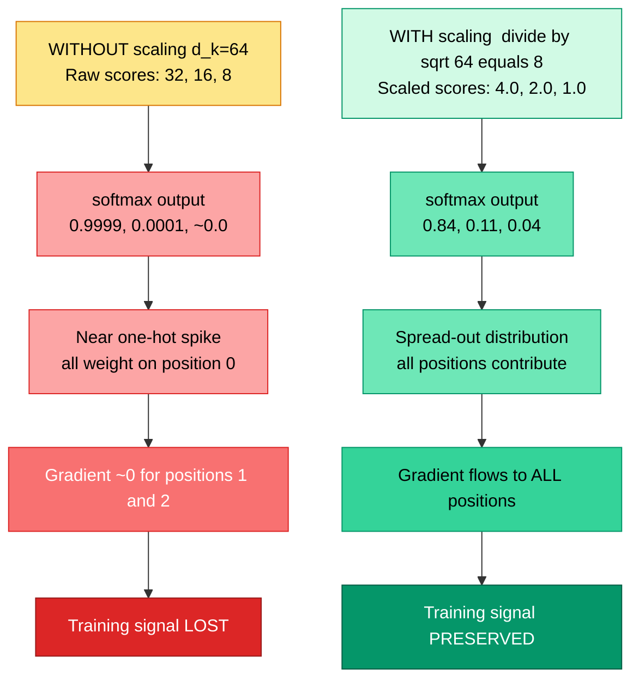
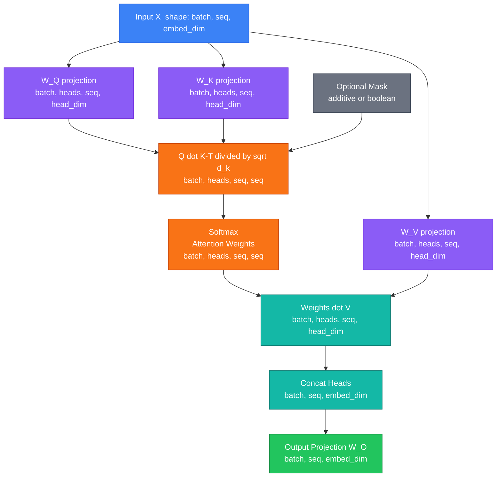
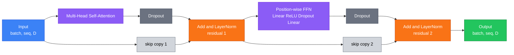
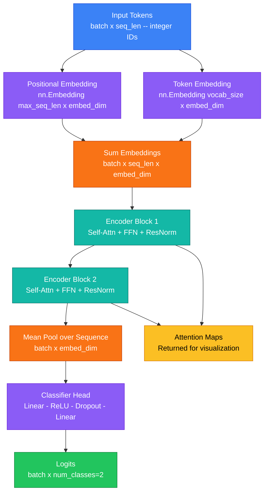
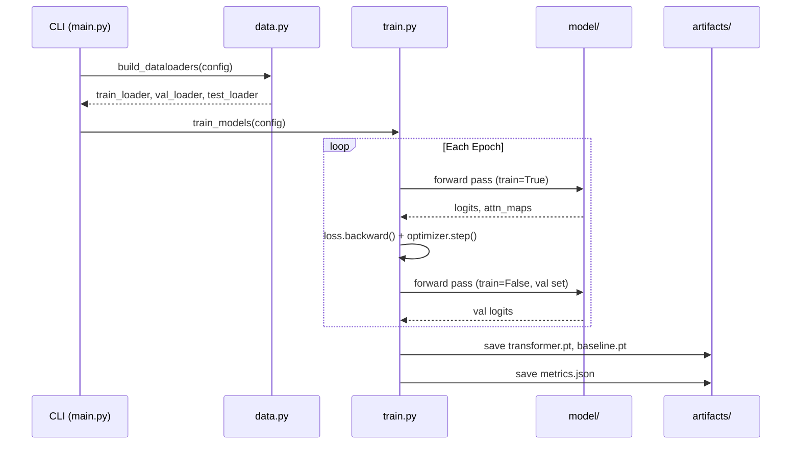
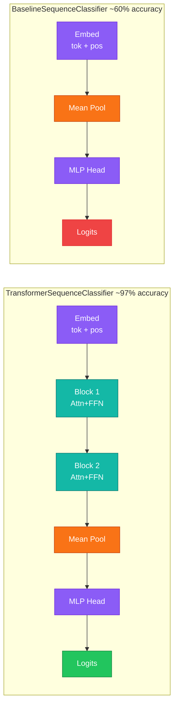
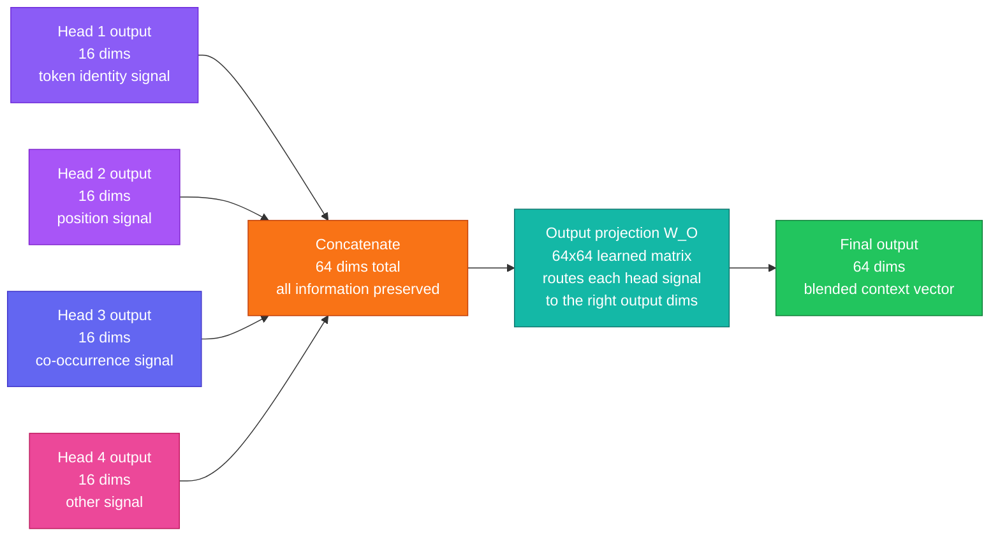
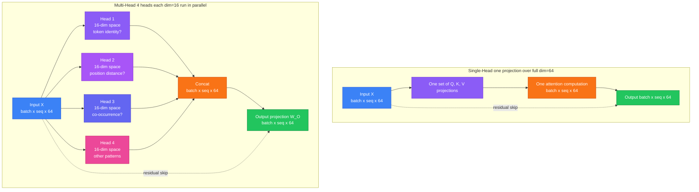
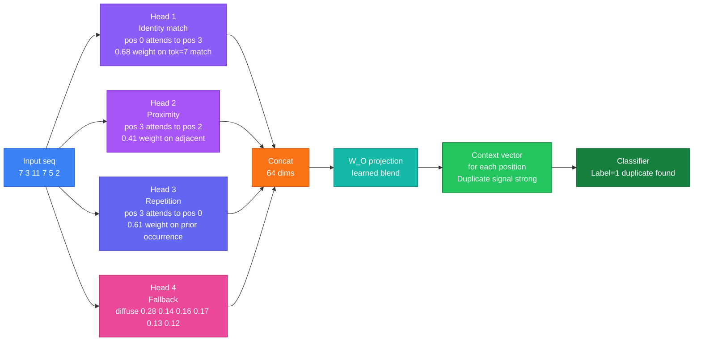
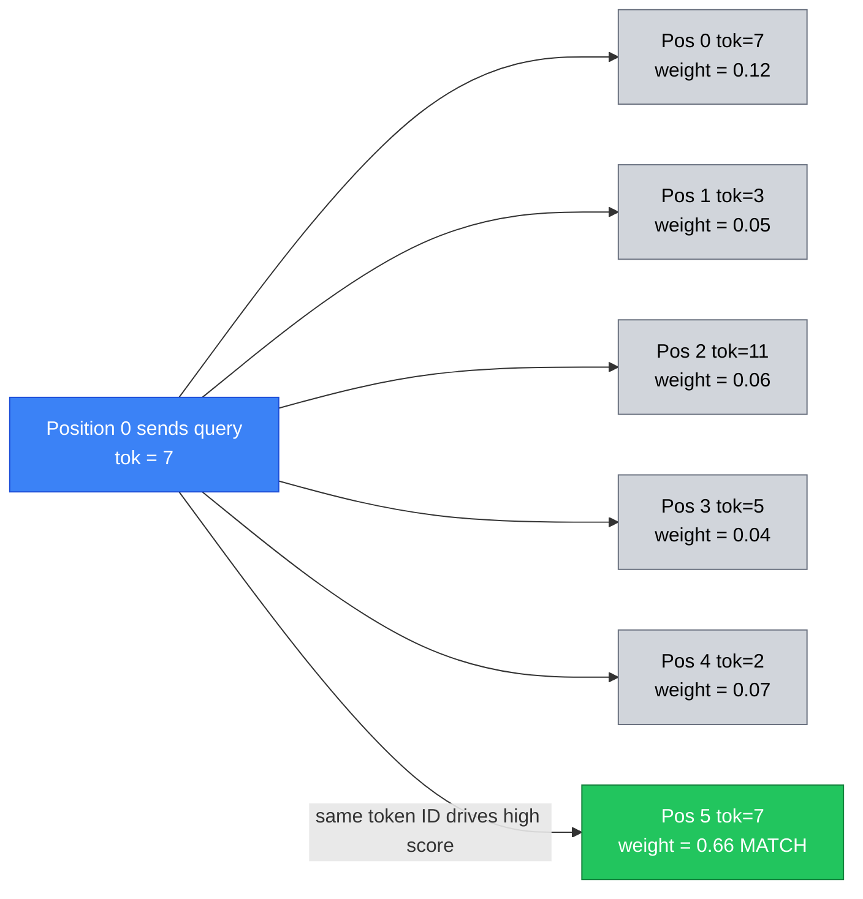

<div align="center">

# Transformer Demo

### Self-Attention and Transformer Encoder Blocks - Built from Scratch in PyTorch

[](https://www.python.org/)
[](https://pytorch.org/)
[](LICENSE)
[](https://github.com/OWNER/REPO/actions)
[](https://github.com/astral-sh/ruff)
[](https://github.com/OWNER/REPO)

</div>

---

## Overview

This project is a **fully runnable, from-scratch implementation** of the Transformer encoder architecture using PyTorch. It was built to make the internals of self-attention and the Transformer block concrete and inspectable rather than hiding them inside framework abstractions. Every component - scaled dot-product attention, multi-head self-attention, the position-wise feed-forward network, residual connections, and layer normalization - is implemented as a plain `nn.Module` and is readable in a few dozen lines of code.

The task chosen to demonstrate the model is **toy sequence classification**: given an integer token sequence of fixed length, the model must predict `1` if the first and last tokens are equal and `0` otherwise. This problem is deliberately designed to require long-range token interaction, which is exactly the strength of self-attention. A baseline MLP model that sees the same tokens but has no attention mechanism is trained alongside the Transformer to make the performance gap visible and measurable.

> [!NOTE]
> This is an educational project. The model sizes are intentionally small so that training completes in seconds on CPU. The architecture choices directly mirror the original "Attention Is All You Need" encoder design (Vaswani et al., 2017).

---

## Table of Contents

- [Why Self-Attention?](#why-self-attention)
- [Architecture Deep Dive](#architecture-deep-dive)
- [Tech Stack](#tech-stack)
- [Project Structure](#project-structure)
- [Setup](#setup)
- [Usage](#usage)
- [Configuration Reference](#configuration-reference)
- [Outputs and Artifacts](#outputs-and-artifacts)
- [Model Comparison](#model-comparison)
- [Notebook Exploration](#notebook-exploration)
- [API Reference](#api-reference)

---

## Why Self-Attention?

Traditional sequence models like RNNs and CNNs process tokens either one at a time or within a fixed local window. This makes it structurally difficult for them to relate tokens that are far apart in a sequence. Self-attention solves this by computing a **direct pairwise relationship score between every token and every other token** in the sequence simultaneously. The result is a weighted mixture of all token representations, where the weights reflect how relevant each other position is when computing the representation for the current position.

| # | <sub>Architecture</sub> | <sub>How it reads tokens</sub> | <sub>Long-range dependency</sub> | <sub>Parallel over sequence</sub> | <sub>Learns from position</sub> | <sub>This project uses it?</sub> |
|---|---|---|---|---|---|---|
| 1 | <sub>RNN / LSTM</sub> | <sub>One token at a time, left to right</sub> | <sub>Weak - signal fades over many steps (vanishing gradient)</sub> | <sub>No - each step depends on the previous</sub> | <sub>Implicitly via recurrent state</sub> | <sub>No</sub> |
| 2 | <sub>CNN (1D)</sub> | <sub>Fixed local window of k adjacent tokens</sub> | <sub>Only if many layers stacked to reach distant positions</sub> | <sub>Yes - all windows computed at once</sub> | <sub>Yes - relative offsets within window</sub> | <sub>No</sub> |
| 3 | <sub>Self-Attention (this project)</sub> | <sub>Every token attends to every other token simultaneously</sub> | <sub>Strong - any two positions connect in one step regardless of distance</sub> | <sub>Yes - all pairwise scores computed in one matrix multiply</sub> | <sub>Via added positional embedding</sub> | <sub>Yes</sub> |
| 4 | <sub>MLP on mean-pooled embeddings (baseline)</sub> | <sub>Averages all token embeddings then applies MLP</sub> | <sub>None - positional information is lost in the average</sub> | <sub>Yes</sub> | <sub>No - position destroyed by pooling</sub> | <sub>Yes (baseline only)</sub> |

> [!NOTE]
> The table above is why the baseline struggles on the endpoint equality task. After mean pooling, position 0 and position 15 are indistinguishable from any other position - the model cannot tell them apart to compare their token IDs.

> [!NOTE]
> **What is a "signal" in this context?**
>
> A signal is information that travels through the model and influences its output. Think of it like a telephone game. Token 1 has information ("I am token ID 7"). To share that information with token 15, it must pass through the model's processing steps. In an RNN, the signal hops from position 1 to position 2 to position 3, and so on - each hop is one step. By the time it reaches position 15, it has been through 14 transformations and the original "I am token 7" message has been diluted or distorted by all the intermediate steps. This is called the **vanishing gradient problem** - not only does the information fade, but the training signal (the gradient that tells the model how to fix its mistakes) also fades over many steps, making it nearly impossible to learn long-range patterns. Self-attention skips all the intermediate hops entirely - token 0 and token 15 compute a direct score with each other in a single operation, so the signal travels in one step regardless of distance.

> [!NOTE]
> **What is a "step" in an RNN?**
>
> In an RNN (Recurrent Neural Network), a "step" is one position in the sequence being processed. The model reads token 0 and produces a hidden state (a vector summarizing everything seen so far). Then it reads token 1 and updates the hidden state. Then token 2, and so on. Each update is one step. A sequence of length 16 requires 16 steps. The problem is that each step applies the same weight matrix to the current hidden state, which means the hidden state is repeatedly multiplied by the same numbers. Mathematically, multiplying a vector by the same matrix over and over causes the values to either shrink toward zero (vanish) or grow toward infinity (explode), depending on the matrix. After 14 steps, the hidden state retains very little of what it saw at step 0. This is structurally different from attention, which never applies a repeated chain of multiplications - every token directly scores every other token without any intermediate steps in between.
>
> ```
> RNN information flow (16 steps):
> tok[0] -> h1 -> h2 -> h3 -> h4 -> h5 -> h6 -> ... -> h15
>   ^                                                     ^
>   original "token 7" signal                     14 transformations later
>   is mostly gone by here                         only faint echo remains
>
> Attention information flow (1 step):
> tok[0] ---scores directly---> tok[15]
>   ^                              ^
>   no intermediate steps          full signal, no dilution
> ```

> [!NOTE]
> **What is an MLP?**
>
> MLP stands for Multi-Layer Perceptron - the most basic type of neural network, also called a "fully connected network" or "dense network." It is a sequence of linear layers (matrix multiplications) with nonlinear activation functions in between. Each layer takes a vector of numbers as input and produces a new vector of numbers as output, where every input number can contribute to every output number.
>
> In this project, two things are called MLPs:
>
> - **The baseline model's "MLP on mean-pooled embeddings"** - the entire baseline classifier is just an MLP applied to the average of all token embeddings. It has no attention, no ability to look at specific positions, and no way to compare individual tokens to each other. It sees only the average.
>
> - **The feed-forward network (FFN) inside each encoder block** - this is also an MLP, but a small one applied per-token after attention. It has two linear layers: `Linear(64 -> 128) -> ReLU -> Dropout -> Linear(128 -> 64)`.
>
> ```
> A 2-layer MLP (what the baseline uses for classification):
>
>  Input vector          Hidden layer              Output
>  [v0, v1, ..., v63]  ->  Linear(64,64)  ->  ReLU  ->  Linear(64,2)  ->  [logit_0, logit_1]
>       64 numbers              64 numbers                                   2 numbers (class scores)
>
> Every input number is connected to every hidden number (that is what "fully connected" means).
> The weights of those connections are what get learned during training.
> ```
>
> The key limitation of an MLP for sequence tasks is that it requires a fixed-size input vector. That is why mean pooling happens first - it collapses the variable-length sequence into one fixed-size vector before the MLP can process it. The collapsing is exactly where positional information is lost.

> [!NOTE]
> **What does "pairwise score between every token and every other token" mean?**
>
> Take a 5-token sentence: `["The", "cat", "sat", "on", "mat"]`. A *pairwise* score means we compute one score for every possible ordered pair of positions - that is 5 x 5 = 25 scores total. Each score answers one specific question: *"when building token i's new representation, how much should it draw from token j?"*
>
> After softmax, those scores become attention weights (each row sums to 1.0). Here is what a well-trained head might produce on this sentence:
>
> |  | The | cat | sat | on | mat |
> |---|---|---|---|---|---|
> | **The** | 0.05 | **0.60** | 0.10 | 0.05 | 0.20 |
> | **cat** | 0.10 | 0.05 | **0.55** | 0.10 | 0.20 |
> | **sat** | 0.05 | **0.50** | 0.05 | 0.15 | 0.25 |
> | **on** | 0.10 | 0.10 | 0.20 | 0.05 | **0.55** |
> | **mat** | 0.15 | 0.20 | 0.25 | **0.40** | 0.00 |
>
> Reading row by row: "The" attends most to "cat" (its noun), "cat" attends most to "sat" (its verb), "sat" attends most to "cat" (its subject), and "on" attends most to "mat" (its prepositional object). No RNN loop is needed - every token directly reaches every other token in one matrix multiplication. The distances between positions ("The" is 3 positions from "on") are irrelevant; the attention weight is learned from content alone, which is exactly why attention handles long-range dependencies so naturally.

The scaling factor $\frac{1}{\sqrt{d_k}}$ in the attention formula is one of the most important details in the original paper and is easy to overlook. Without it, the dot products between queries and keys grow proportionally to the embedding dimension, and that causes a serious problem during training.

> [!WARNING]
> **Why large dot products break training - a concrete example.**
>
> Imagine `embed_dim = 64` and each Q and K vector has entries drawn from a standard normal distribution. A dot product sums 64 independent multiplications of two random values. The variance of that sum grows linearly with dimensionality: $\text{Var}(q \cdot k) = d_k$, so the standard deviation of raw scores grows as $\sqrt{d_k} = 8$. Scores that look like `[32, 16, 8]` (unscaled) become `[4.0, 2.0, 1.0]` after dividing by $\sqrt{64} = 8$.
>
> Here is what softmax does to those two cases:
>
> | Scores | softmax output | What the model learns |
> |---|---|---|
> | `[32, 16, 8]` | `[0.9999, 0.0001, ~0.0]` | Only position 0 matters, all others ignored |
> | `[4.0, 2.0, 1.0]` | `[0.84, 0.11, 0.04]` | All three positions contribute usefully |
>
> When softmax produces a near-one-hot spike, the gradient of the loss with respect to the attention score inputs is almost exactly zero for all non-maximum positions. This is called **softmax saturation** - the model effectively stops learning from most of the attention weights. Dividing by $\sqrt{d_k}$ keeps scores in a range where softmax stays spread-out and gradients remain non-zero.

> [!NOTE]
> **Why is "only position 0 matters" so harmful, and what happens if you skip softmax entirely?**
>
> **Problem 1 - softmax saturation makes most weights unlearnable.** When unscaled scores produce `softmax([32, 16, 8]) = [0.9999, 0.0001, ~0.0]`, the weights for positions 1 and 2 are frozen near zero. The model cannot learn to pay attention to them even when they contain the correct answer, because the gradient signal that would adjust those weights has vanished. The model is stuck - it has "decided" that position 0 always matters most, and it can barely escape that local minimum.
>
> **Problem 2 - without softmax at all, the weights would be raw unbounded numbers.** Softmax serves two purposes: (1) it normalizes scores into a valid probability distribution that sums to 1.0, and (2) it amplifies the differences between scores in a controlled way. Without softmax, the attention output would just be `scores · V` where scores could be any large positive or negative number. There is no guarantee the output stays in a bounded range, training becomes numerically unstable, and the output cannot be interpreted as a weighted mixture - you lose the elegant "how much do I draw from each token" semantics entirely.
>
> **Problem 3 - why low scores disappear fastest under softmax saturation.** The softmax function is $e^{x_i} / \sum_j e^{x_j}$. When one score is much larger than the others, its exponential dominates the denominator. The exponential grows so fast that a score of 8 vs 32 is not "4x smaller" - it is $e^{-24}$ times smaller, which is essentially zero. So the lowest score does not get "slightly less" attention - it gets attention that rounds to zero to many decimal places. This is why scaling matters: it keeps all scores close enough together that the exponentials stay in a comparable range.



$$\text{Attention}(Q, K, V) = \text{softmax}\!\left(\frac{QK^T}{\sqrt{d_k}}\right)V$$

Multi-head attention repeats this process in parallel across several learned subspaces, allowing the model to jointly attend to information from different representational perspectives at different positions. "Different representational perspectives" means each head gets its own learned Q, K, V projection matrices - so each one learns to look for a fundamentally different type of relationship in the data.

> [!NOTE]
> **What does "different representational perspectives" actually look like? Real examples.**
>
> In large language models trained on real text, researchers have found that individual attention heads specialize in surprisingly concrete tasks. Here are examples of the kinds of roles heads can learn:
>
> | Head role | What it detects | Example |
> |---|---|---|
> | **Syntactic subject-verb** | Which noun is the subject of which verb | "The cat sat" - "cat" and "sat" get high mutual attention |
> | **Coreference** | Which pronoun refers to which noun | "Alice said she..." - "she" attends to "Alice" |
> | **Positional proximity** | Tokens near each other in the sequence | Bigram-style local relationships |
> | **Delimiter tracking** | Commas, periods, brackets | A comma head attends from the clause before to the clause after |
> | **Semantic similarity** | Tokens with similar meaning | Synonyms or related words attend to each other |
> | **Copy/match** | Identical or repeated tokens | A head that fires when two positions hold the same token value |
>
> In **this project specifically**, the model needs to solve "does position 0 equal position 15?" One head will likely specialize in the **copy/match** role - it learns Q and K projections where the same token ID produces a high dot product with itself across any distance. Another head might specialize in positional anchoring ("am I near the start or end of the sequence?"). The other two heads can learn complementary or backup patterns.
>
> This specialization is why removing multi-head and using a single head would hurt performance: a single head's Q and K projections have to simultaneously solve all of these problems, which is a much harder optimization target.

> [!IMPORTANT]
> The task (first token equals last token) is designed so that a model **without** attention cannot reliably solve it after mean-pooling, because averaging destroys positional information. The Transformer can solve it precisely because attention can learn to directly compare position 0 and position $L-1$.

---

## Architecture Deep Dive

### Scaled Dot-Product Attention

The atomic unit of the Transformer is scaled dot-product attention. The query matrix $Q$, key matrix $K$, and value matrix $V$ are all linear projections of the input. Dot products between queries and keys produce a raw score matrix. After scaling and softmax normalization, these scores become attention weights that are used to compute a weighted sum of the value vectors. The result is a new representation for each token that incorporates context from the entire sequence.

> [!NOTE]
> **What are Q, K, and V?** The names come from a database lookup analogy. The **Query** ($Q$) is the question a token is asking: "what information do I need from the rest of the sequence?" The **Key** ($K$) is a label each token broadcasts: "here is what kind of information I hold." The **Value** ($V$) is the actual content a token will contribute if it gets selected. A high dot product between query $i$ and key $j$ means "token $i$'s question matches token $j$'s label," so token $j$'s value flows strongly into token $i$'s new representation. All three - Q, K, V - are separate learned linear transformations of the same input $X$, meaning the model learns what questions to ask, what labels to advertise, and what content to share, all through training.

> [!NOTE]
> **What is an Attention Map?** After the softmax step, the output is a matrix of shape `(seq_len, seq_len)` called the **attention map** or attention weight matrix. Each row $i$ contains a probability distribution over all token positions, showing how much token $i$ "attends to" every other token. A value of `0.9` in row 3, column 0 means: when computing the updated representation for position 3, the model draws 90% of its information from position 0. These maps are what get visualized as heatmaps in `artifacts/attention_heatmap_layer*.png` - bright cells reveal which token pairs the model considers important for the classification decision.



### Transformer Encoder Block

Each encoder block applies self-attention followed by a position-wise feed-forward network (FFN). Both sub-layers use **Pre-LN style** residual connections - a residual skip connection wraps each sub-layer, and layer normalization is applied after the addition. Dropout is applied to the output of each sub-layer before the residual addition, acting as a regularizer.

> [!NOTE]
> **What is an Encoder Block?** An encoder block is a self-contained, reusable processing unit. It takes a sequence of vectors as input and returns an equal-length sequence of vectors as output - the shape never changes. Inside, it does exactly two things in order: (1) multi-head self-attention so every token gathers context from every other token, and (2) a feed-forward network applied independently to each position.
>
> **Concrete walkthrough - one block processing the sentence `["cat", "sat", "mat"]`:**
>
> ```
> Input to Block 1  (3 tokens x 64 dims each):
>   "cat"  → [0.21, -0.55, 1.03, ...]   (64 numbers encoding "cat")
>   "sat"  → [0.88,  0.12, -0.73, ...]  (64 numbers encoding "sat")
>   "mat"  → [-0.44, 0.67,  0.31, ...]  (64 numbers encoding "mat")
>
> After Self-Attention inside Block 1:
>   "cat"  → [0.45, -0.31, 0.91, ...]   (now knows about "sat" and "mat")
>   "sat"  → [0.72,  0.38, -0.50, ...]  (now knows about "cat" and "mat")
>   "mat"  → [-0.20, 0.81,  0.55, ...]  (now knows about "cat" and "sat")
>
> After FFN inside Block 1  (same shape, nonlinearly transformed):
>   "cat"  → [0.61, -0.12, 1.15, ...]   (further enriched)
>   "sat"  → [0.90,  0.55, -0.31, ...]  (further enriched)
>   "mat"  → [-0.10, 0.92,  0.71, ...]  (further enriched)
>
> Output feeds directly into Block 2 as its input.
> ```
>
> The word *encoder* means the block reads and enriches an existing representation - it never generates or predicts new tokens (that is what a *decoder* does). The word *block* is just one complete layer. The *encoder stack* is `num_layers=2` blocks chained end-to-end.

> [!NOTE]
> **What is a Feed-Forward Network (FFN)?** The FFN in this project is a small two-layer MLP: `Linear(64→128) → ReLU → Dropout → Linear(128→64)`. It is applied identically and independently to each token position - the same weight matrix is reused for every position, which is why it is called *position-wise*. Its purpose is to add nonlinear transformation capacity after the attention step. Attention is fundamentally a weighted average (a linear operation), so without the FFN, stacking more blocks would collapse into a single linear transform. The FFN is where the model learns to transform and store token-specific features.

> [!NOTE]
> **What is ReLU?** ReLU stands for Rectified Linear Unit. It is the activation function `f(x) = max(0, x)` - positive values pass through unchanged, negative values become zero. It is placed between the two linear layers of the FFN to introduce nonlinearity. Without it, two linear layers collapse into one linear layer and the network could only learn linear transformations.
>
> **Concrete numerical example:**
>
> ```
> Input to FFN for one token:  [-1.2,  3.4,  0.0, -0.5,  2.1]
>
> After Linear(64→128):
>   hidden = [-2.1,  1.8, -0.3,  4.2, -1.5, ...]
>
> After ReLU  max(0, x):
>   hidden = [ 0.0,  1.8,  0.0,  4.2,  0.0, ...]
>   (all negative values become 0 - the neuron "did not fire")
>
> After Linear(128→64):
>   output = [new enriched 64-dim representation]
> ```
>
> The neurons that output zero are said to be "dead" for that input - they contribute nothing. This is intentional: the network learns which features to activate for which inputs. Neurons that are dead for irrelevant features simply pass no signal, creating a sparse, efficient representation. ReLU avoids the vanishing gradient problem that affected sigmoid/tanh, which saturate near 0 or 1 and produce gradients close to zero even for inputs far from their operating range.

> [!NOTE]
> **What is Dropout?** Dropout is a regularization technique that prevents overfitting by randomly zeroing out activations during training. With `--dropout 0.1`, exactly 10% of outputs are zeroed at random on every forward pass. Each batch sees a different random mask, so the network cannot memorize any single path through the weights.
>
> **Concrete example - before and after dropout (p=0.1, training mode):**
>
> ```
> Attention output for one token (16 values shown):
>   Before: [0.82, -0.31, 1.20,  0.05, -0.77, 0.44, 1.03, -0.12,
>             0.66,  0.38, -0.90, 0.71,  0.23, -0.55, 0.88,  0.14]
>
>   Dropout mask (1=keep, 0=zero, ~10% zeroed):
>            [  1,    1,    1,    1,    0,    1,    1,    1,
>               1,    0,    1,    1,    1,    1,    1,    1  ]
>
>   After:  [0.82, -0.31, 1.20,  0.05,  0.00, 0.44, 1.03, -0.12,
>             0.66,  0.00, -0.90, 0.71,  0.23, -0.55, 0.88,  0.14]
>            (positions 4 and 9 zeroed this batch - different positions next batch)
> ```
>
> Because the zeroed positions are random and change every batch, the network learns to distribute information redundantly rather than routing everything through a small number of high-weight paths. During evaluation, `model.eval()` disables dropout and all activations are live. The outputs are also rescaled by `1/(1-p)` during training so that the expected value of each activation remains the same at inference time.



### Full Model Forward Pass

The complete `TransformerSequenceClassifier` stacks two encoder blocks. Token IDs and their positions are each embedded and summed to produce the initial representation. After the encoder stack, mean pooling collapses the sequence dimension, and a small two-layer MLP head maps the pooled vector to class logits.

> [!NOTE]
> **What is a Token ID?** A token is the basic unit of input to the model. In real NLP systems a token might be a word or sub-word piece; in this project tokens are simply integers sampled from `[0, vocab_size)`. A **Token ID** is the integer that identifies which vocabulary entry a position holds - for example, token ID `7` might represent the word "cat" in a real vocabulary, or just abstract symbol 7 in this toy task. The model converts token IDs into dense floating-point vectors through an embedding lookup table (`nn.Embedding`), which maps each integer to a unique learned 64-dimensional vector. The same token ID always maps to the same vector, regardless of where in the sequence it appears - that is why the positional embedding is added on top, to inject position information.

> [!NOTE]
> **Encoder Block vs Encoder Stack:** A single **encoder block** is one processing layer (attention + FFN + residual + norm). The **encoder stack** (set by `--num-layers`) is multiple blocks wired sequentially. Block 2 receives the enriched output of Block 1 as its input and can build higher-level abstractions on top of it. Early blocks tend to learn surface-level token interactions; later blocks can learn more abstract compositional patterns. In this project the stack depth is 2, which is minimal but sufficient for the toy classification task.

> [!NOTE]
> **What is Mean Pooling?** After the encoder stack, we have a tensor of shape `(batch, seq_len, embed_dim)` - one 64-dimensional vector for each of the 16 token positions. To classify the whole sequence with a single label, we need one vector. Mean pooling computes the arithmetic mean across the sequence dimension, producing `(batch, embed_dim)`. It is the simplest possible aggregation: take every token's representation and average them. The critical limitation is that mean pooling is permutation-invariant - it cannot tell you where in the sequence a pattern occurred, only that it occurred somewhere. This is why the baseline model (which also uses mean pooling but lacks attention) cannot reliably solve the first-equals-last task: after averaging, all positional information is gone.



### Tensor Shape Flow Through the Model

Every operation in the forward pass transforms the tensor shape in a specific way. This table traces a single batch of 64 sequences through every layer so you can see exactly what shape is entering and leaving each component.

| # | <sub>Layer / Operation</sub> | <sub>Input shape</sub> | <sub>Output shape</sub> | <sub>What changes and why</sub> |
|---|---|---|---|---|
| 1 | <sub>Input token IDs</sub> | <sub>-</sub> | <sub>(64, 16)</sub> | <sub>batch=64 sequences, each 16 integer token IDs</sub> |
| 2 | <sub>Token embedding lookup</sub> | <sub>(64, 16)</sub> | <sub>(64, 16, 64)</sub> | <sub>Each integer maps to a 64-dim learned vector</sub> |
| 3 | <sub>Positional embedding lookup</sub> | <sub>(64, 16)</sub> | <sub>(64, 16, 64)</sub> | <sub>Each position index maps to a 64-dim learned vector</sub> |
| 4 | <sub>Embedding sum</sub> | <sub>(64, 16, 64) + (64, 16, 64)</sub> | <sub>(64, 16, 64)</sub> | <sub>Token identity + position fused into one vector per token</sub> |
| 5 | <sub>Q, K, V projections (per head, per layer)</sub> | <sub>(64, 16, 64)</sub> | <sub>(64, 16, 16) each</sub> | <sub>Full 64-dim split into 4 x 16-dim subspaces</sub> |
| 6 | <sub>Scaled dot-product attention (per head)</sub> | <sub>Q,K: (64, 16, 16) V: (64, 16, 16)</sub> | <sub>(64, 16, 16)</sub> | <sub>Attended output - same shape as V; attention map is (64, 16, 16)</sub> |
| 7 | <sub>Concat all heads</sub> | <sub>4 x (64, 16, 16)</sub> | <sub>(64, 16, 64)</sub> | <sub>Four 16-dim outputs placed side by side</sub> |
| 8 | <sub>Output projection W_O</sub> | <sub>(64, 16, 64)</sub> | <sub>(64, 16, 64)</sub> | <sub>64x64 matrix blends the concatenated heads</sub> |
| 9 | <sub>Residual add + LayerNorm</sub> | <sub>(64, 16, 64) + (64, 16, 64)</sub> | <sub>(64, 16, 64)</sub> | <sub>Shape unchanged - stabilizes activations</sub> |
| 10 | <sub>Feed-forward network</sub> | <sub>(64, 16, 64)</sub> | <sub>(64, 16, 64)</sub> | <sub>Expands to 128 internally then back to 64</sub> |
| 11 | <sub>Residual add + LayerNorm</sub> | <sub>(64, 16, 64)</sub> | <sub>(64, 16, 64)</sub> | <sub>Shape unchanged - end of one encoder block</sub> |
| 12 | <sub>Encoder Block 2 (same as 5-11)</sub> | <sub>(64, 16, 64)</sub> | <sub>(64, 16, 64)</sub> | <sub>Second pass; operates on enriched vectors from Block 1</sub> |
| 13 | <sub>Mean pool over sequence</sub> | <sub>(64, 16, 64)</sub> | <sub>(64, 64)</sub> | <sub>Average across 16 positions - sequence dimension removed</sub> |
| 14 | <sub>Classifier Linear 1 + ReLU</sub> | <sub>(64, 64)</sub> | <sub>(64, 64)</sub> | <sub>Nonlinear transform, shape preserved</sub> |
| 15 | <sub>Classifier Linear 2 (output)</sub> | <sub>(64, 64)</sub> | <sub>(64, 2)</sub> | <sub>Projects to 2 class logits (label 0 or 1)</sub> |

> [!NOTE]
> Steps 5-11 describe a single encoder block. With `num_layers=2` those steps execute twice in sequence. The sequence dimension (16) is present through step 12 and only collapses at step 13 (mean pooling). Everything from step 14 onward works on one vector per sequence in the batch.

---

### Training Pipeline

Both the Transformer and the Baseline are trained using the same data splits, optimizer family, and loss function so the comparison is apples-to-apples. Each epoch runs a full pass over the training set with gradient updates, followed by a validation pass in `torch.no_grad()` context. Metrics are collected per epoch and persisted at the end.

#### Training Hyperparameter Reference

Every hyperparameter that affects training behavior is listed below with its default value, the flag to change it, what it controls, and what happens if you push it too high or too low.

| # | <sub>Hyperparameter</sub> | <sub>Default</sub> | <sub>CLI flag</sub> | <sub>What it controls</sub> | <sub>Too low causes</sub> | <sub>Too high causes</sub> |
|---|---|---|---|---|---|---|
| 1 | <sub>epochs</sub> | <sub>15</sub> | <sub>`--epochs`</sub> | <sub>How many full passes over training data</sub> | <sub>Underfitting - model has not converged</sub> | <sub>Overfitting - memorizes training set</sub> |
| 2 | <sub>batch-size</sub> | <sub>64</sub> | <sub>`--batch-size`</sub> | <sub>Sequences per gradient update step</sub> | <sub>Noisy gradients, slow wall-clock time</sub> | <sub>Smooth but sharp minima, higher memory use</sub> |
| 3 | <sub>lr (learning rate)</sub> | <sub>1e-3</sub> | <sub>`--lr`</sub> | <sub>Step size for Adam weight updates</sub> | <sub>Very slow convergence</sub> | <sub>Loss diverges or oscillates</sub> |
| 4 | <sub>embed-dim</sub> | <sub>64</sub> | <sub>`--embed-dim`</sub> | <sub>Dimensionality of all token and positional vectors</sub> | <sub>Model lacks capacity to represent token differences</sub> | <sub>Overkill for this toy task, slower training</sub> |
| 5 | <sub>num-heads</sub> | <sub>4</sub> | <sub>`--num-heads`</sub> | <sub>Number of parallel attention heads</sub> | <sub>1 head must learn all relationship types at once</sub> | <sub>head-dim too small to encode useful queries/keys</sub> |
| 6 | <sub>num-layers</sub> | <sub>2</sub> | <sub>`--num-layers`</sub> | <sub>Number of stacked encoder blocks</sub> | <sub>1 round of attention may miss complex patterns</sub> | <sub>Vanishing gradients, more compute for no gain on this task</sub> |
| 7 | <sub>dropout</sub> | <sub>0.1</sub> | <sub>`--dropout`</sub> | <sub>Fraction of activations randomly zeroed during training</sub> | <sub>0.0 - no regularization, overfits small datasets</sub> | <sub>0.5+ - too much noise, model cannot converge</sub> |
| 8 | <sub>seq-len</sub> | <sub>16</sub> | <sub>`--seq-len`</sub> | <sub>Length of every generated sequence</sub> | <sub>Task is trivially easy (position 0 and 1 are neighbors)</sub> | <sub>Harder long-range task, needs more heads/layers</sub> |
| 9 | <sub>vocab-size</sub> | <sub>20</sub> | <sub>`--vocab-size`</sub> | <sub>Number of distinct token IDs (0 to N-1)</sub> | <sub>High duplicate rate makes task too easy</sub> | <sub>Very rare duplicates - class imbalance worsens</sub> |



### Comparison Architecture

The baseline model uses the same token and positional embedding as the Transformer, but replaces the encoder stack with a direct MLP applied to the mean-pooled embedding. This is equivalent to a bag-of-embeddings model. It cannot learn positional structure and cannot directly compare distant tokens, which is why it systematically underperforms on the first-equals-last task.



> [!TIP]
> Open `notebooks/attention_exploration.ipynb` after training to interactively inspect which token pairs receive high attention weights across both layers and all four heads. You will see that the model learns to allocate attention to position 0 and position $L-1$ to solve the task.

### Single-Head vs Multi-Head Attention

Single-head attention runs the scaled dot-product attention once over the full `embed_dim=64` space. Multi-head attention splits that space into `num_heads=4` smaller subspaces of size `head_dim = 64 / 4 = 16`, runs attention independently in each subspace, and concatenates the four results back to 64 dimensions before a final linear projection. Each head has its own learned Q, K, V projection matrices, so each head can specialize in discovering a different kind of token relationship.

> [!NOTE]
> **Single-head vs Multi-head - why does it matter?** A single attention head must simultaneously represent all types of relationships a token has with others using one shared set of projections. Multi-head attention gives each head its own independent projections, so Head 1 might learn to match token values (exactly what this task needs), Head 2 might track positional proximity, Head 3 might detect repetition, and Head 4 might learn a fallback catch-all pattern. The heads run in parallel and are cheap because each one works in a smaller `head_dim`-dimensional space rather than the full `embed_dim` space.

> [!NOTE]
> **How do the heads "vote" on context - how does the output get combined?**
>
> The heads do not vote like a committee where the majority wins. Instead they **contribute different information to different dimensions of the same output vector**, and a learned linear layer decides how to weight and blend those contributions. Here is the exact mechanism step by step:
>
> **Step 1 - Each head produces its own attended output independently.**
> Every head runs its own scaled dot-product attention in a 16-dimensional subspace and produces a result of shape `(batch, seq, 16)`. The four heads run in parallel with no communication between them.
>
> ```
> Head 1 output:  [0.82, -0.31, 1.20, 0.05, ...]   shape (batch, seq, 16)
> Head 2 output:  [0.44,  0.71, -0.55, 0.38, ...]  shape (batch, seq, 16)
> Head 3 output:  [-0.12, 0.93,  0.28, -0.60, ...]  shape (batch, seq, 16)
> Head 4 output:  [0.61, -0.44,  0.17,  0.80, ...]  shape (batch, seq, 16)
> ```
>
> **Step 2 - Concatenate all heads into one wide vector.**
> The four 16-dimensional outputs are concatenated side by side, producing a single `(batch, seq, 64)` tensor. No information is lost or merged yet - the four blocks of 16 dimensions sit next to each other.
>
> ```
> Concatenated:  [0.82, -0.31, 1.20, 0.05, ... | 0.44, 0.71, -0.55, 0.38, ... | ...]
>                 <--- Head 1: 16 dims --->       <--- Head 2: 16 dims --->
>                 shape: (batch, seq, 64)
> ```
>
> **Step 3 - The output projection W_O blends everything.**
> The concatenated 64-dimensional vector is passed through a final linear layer `W_O` of shape `(64, 64)`. This is a full matrix multiply - every output dimension can draw from every input dimension across all heads. This is where the actual "combining opinions" happens. `W_O` is learned during training, so it learns which head's information matters for which output dimension.
>
> ```
> Final output = Concat([H1, H2, H3, H4]) @ W_O    shape: (batch, seq, 64)
> ```
>
> **Concrete analogy.** Imagine four reviewers each reading the same document and highlighting different things: one marks character names, one marks dates, one marks locations, one marks emotions. They hand their highlighted copies to an editor (W_O) who reads all four simultaneously and writes a single synthesis. The editor decides how much weight to give each reviewer's highlights when composing the final summary. That synthesis is what gets passed to the next encoder block.
>
> **Why passing it to the next block matters.** Each encoder block takes the output of the previous block as its input - so the second block does not see the original raw token embeddings, it sees the already-enriched context vectors that the first block produced. This means Block 2's attention heads are not asking "which raw token IDs are similar?" - they are asking "which already-contextualized representations are similar?" The model builds understanding in layers. Block 1 might learn low-level patterns (token identity, proximity). Block 2 receives those patterns baked into the vectors and can detect higher-level structure on top of them - like noticing that two positions both have the "this token appeared elsewhere" signal from Block 1, and amplifying that into a stronger classification signal. Without stacking blocks, the model is limited to one round of cross-token communication. Each additional block is another full round where every token can update its representation based on what all other tokens now look like after the previous round.
>
> **What would Block 3, 4, 5 and deeper blocks do?**
>
> This project uses only 2 blocks because the task is simple enough to solve in 2 rounds of attention. But the pattern continues upward and is visible in real-world models like BERT (12 blocks) and GPT-2 (24 blocks). Here is what each additional depth level tends to learn, using the endpoint equality task as the anchor example:
>
> **Block 1 - surface matching.** The raw token embeddings are still close to their initialized values. Block 1 heads learn basic relationships: "token 7 at position 0 looks similar to token 7 at position 3" (identity), "position 4 is next to position 5" (proximity). The output vectors are slightly enriched - each token now knows something about its immediate neighborhood. In real NLP, Block 1 typically learns part-of-speech-like patterns: "this word tends to follow a noun" or "this word is usually a verb."
>
> **Block 2 - patterns of surface patterns.** Block 2 receives vectors that already encode "I have a nearby match" or "I am isolated." It can now ask higher-level questions: "do BOTH position 0 AND position 15 have the same match signal?" rather than "do they share a token ID?" This is one level of abstraction higher. In real NLP, Block 2 tends to learn phrase-level patterns: "noun-verb agreement," "adjective modifies the next noun."
>
> **Block 3 - relationship chains.** Block 3 operates on vectors that already encode pairwise match and co-occurrence structure. It can now detect that the match signal at position 0 and the match signal at position 15 are correlated - which is exactly the classification criterion. In real NLP, Block 3 often encodes clause-level structure: "this is the subject of the main verb."
>
> **Blocks 4-6 - compositional structure.** Each block can attend over the representations produced by the previous one, building larger and larger compositional structures. By Block 6 in BERT, tokens encode sentence-level roles. In a deeper model on a harder task (e.g. "do token[0] and token[15] both appear at least twice elsewhere in the sequence?"), you would genuinely need 4-6 blocks to encode that chain of reasoning.
>
> **Blocks 7-12 (BERT depth) - task-specific abstraction.** In real language models, mid-depth blocks encode semantic relationships ("this pronoun refers to that noun phrase four tokens back"). Attention weights in these blocks often look almost random to human eyes - they are capturing abstract semantic proximity that no longer maps cleanly to surface-level token similarity.
>
> **Blocks 13-24 (GPT-2 depth) - output preparation.** The deepest blocks in very large models appear to shift from building representations to preparing the output. In GPT-2, the last few blocks are essentially "formatting" the representation for the final classification or next-token prediction, undoing some of the abstraction from mid-depth blocks to produce a form the linear head can act on.
>
> **For this project's task, 2 blocks is optimal.** Block 1 finds the candidate matches. Block 2 confirms that the endpoints are the ones that matched and suppresses false positives. A third block would have little new information to work with and would just add noise and parameters with no accuracy gain.

#### Encoder Block Depth - What Each Layer Level Learns

| # | <sub>Block depth</sub> | <sub>Input to this block</sub> | <sub>Typical patterns learned</sub> | <sub>Real NLP analogy</sub> | <sub>Needed for this task?</sub> |
|---|---|---|---|---|---|
| 1 | <sub>Block 1</sub> | <sub>Raw token + position embeddings</sub> | <sub>Token identity matches, positional neighbors, direct co-occurrence</sub> | <sub>Part-of-speech, capitalization, character n-grams</sub> | <sub>Yes - finds the candidate duplicate pairs</sub> |
| 2 | <sub>Block 2</sub> | <sub>Block 1 output - "who is similar to who"</sub> | <sub>Patterns of matches - are both endpoints marked as duplicates?</sub> | <sub>Phrase structure, noun-verb agreement, local dependency</sub> | <sub>Yes - confirms endpoints are the matching pair</sub> |
| 3 | <sub>Block 3</sub> | <sub>Block 2 output - "which pairs are confirmed"</sub> | <sub>Relationship chains across confirmed pairs</sub> | <sub>Clause structure, subject-object relations</sub> | <sub>Not needed for this task - diminishing returns</sub> |
| 4 | <sub>Blocks 4-6</sub> | <sub>Compositional structure from Block 3</sub> | <sub>Larger compositional groupings, nested relationships</sub> | <sub>Sentence-level roles, coreference chains</sub> | <sub>Only if task required multi-step reasoning chains</sub> |
| 5 | <sub>Blocks 7-12</sub> | <sub>Clause-level representations</sub> | <sub>Abstract semantic proximity, discourse-level patterns</sub> | <sub>"This pronoun refers to that noun 8 tokens back"</sub> | <sub>Only for real language tasks with complex semantics</sub> |
| 6 | <sub>Blocks 13-24</sub> | <sub>Semantic representations</sub> | <sub>Output preparation - reformatting for the classifier head</sub> | <sub>Task-specific prediction formatting</sub> | <sub>Only in very large models on very complex tasks</sub> |
>
> **Why this is better than averaging - and no, single-head does not average either.** Single-head attention does not average the head outputs - there is only one head, so there is nothing to combine. What single-head does instead is run the full scaled dot-product attention once over the entire 64-dimensional space in one shot, producing a single 64-dim attended output directly. The averaging comparison is about a hypothetical bad design where you replace the concat-then-project step with a simple mean across the four head outputs. That bad design would produce `(H1 + H2 + H3 + H4) / 4` - a 16-dim vector where every head contributed exactly 25% to every output dimension, with no learned routing. The actual multi-head design instead places all four 16-dim outputs side by side (preserving all 64 dimensions separately) and then lets W_O - a full 64x64 matrix - decide how to blend them. W_O can put 80% of Head 1's signal into the first 20 output dimensions and nearly zero elsewhere, while simultaneously routing Head 2's signal heavily into a different set of dimensions. That selective routing is what makes multi-head strictly more expressive than either single-head or a naive average.





---

### What Each Head Actually Learns - Perspectives and Examples

The four heads do not receive different inputs - they all start from the same token embeddings. What makes them different is that each head has its own independently trained Q, K, V weight matrices. Because the loss function only cares about the final classification, each head is free to discover whatever internal representation helps most. Training pressure naturally pushes them toward complementary roles, because if two heads learned identical patterns they would both occupy 16 dimensions of the output doing the same job - a waste the optimizer tends to avoid.

| # | <sub>Head</sub> | <sub>Likely role</sub> | <sub>Q looks for</sub> | <sub>K responds to</sub> | <sub>Attention pattern shape</sub> | <sub>Fires strongest when</sub> |
|---|---|---|---|---|---|---|
| 1 | <sub>Head 1 - Identity</sub> | <sub>Token exact match</sub> | <sub>Vectors similar to the query token's embedding</sub> | <sub>Tokens with same ID as query</sub> | <sub>Off-diagonal bright spots where token IDs match</sub> | <sub>A duplicate token exists anywhere in the sequence</sub> |
| 2 | <sub>Head 2 - Proximity</sub> | <sub>Neighboring context</sub> | <sub>Nearby positions</sub> | <sub>Adjacent or near-adjacent positions</sub> | <sub>Bright band along the main diagonal</sub> | <sub>Duplicate tokens are adjacent (positions i and i+1)</sub> |
| 3 | <sub>Head 3 - Repetition</sub> | <sub>Prior occurrence detection</sub> | <sub>Positions where this token has appeared earlier</sub> | <sub>Earlier positions with matching token</sub> | <sub>Lower-triangular bright spots at matching positions</sub> | <sub>Current position is a second (or later) occurrence</sub> |
| 4 | <sub>Head 4 - Fallback</sub> | <sub>Global average context</sub> | <sub>Broadly distributed across all positions</sub> | <sub>All positions roughly equally</sub> | <sub>Nearly uniform gray across all cells</sub> | <sub>Always active; stabilizes when Heads 1-3 are uncertain</sub> |

> [!NOTE]
> These roles emerge from training - they are not programmed. The table reflects what gradient descent tends to discover on this task. A different random seed may swap which head index takes which role, but the model almost always converges to having at least one head that solves the identity-match problem (because it is the most direct path to low loss).

Below are the four plausible specializations for this particular task (finding duplicate tokens in a sequence), along with a concrete worked example for the sentence-like token sequence `[7, 3, 11, 7, 5, 2]` where token `7` appears twice at positions 0 and 3.

---

#### Head 1 - Token Identity Matching

**What it learns:** Q and K projections that produce high dot-product scores when two positions share the same token ID. It is essentially learning an embedding-space nearest-neighbor lookup.

**Why this task rewards it:** The task is "does any token appear more than once?" A head that can spot exact repeats directly solves the problem. Training will push at least one head toward this because it is the most direct signal.

**Worked example** - position 0 queries for matches:

```
Token sequence:   [  7,   3,  11,   7,   5,   2 ]
Position:         [  0,   1,   2,   3,   4,   5 ]

Head 1 raw scores (Q_0 · K_j):
  pos 0 (tok=7):  +1.82   <- self, moderately high
  pos 1 (tok=3):  -0.44   <- different token, low
  pos 2 (tok=11): -0.71   <- different token, low
  pos 3 (tok=7):  +2.31   <- SAME TOKEN - highest score
  pos 4 (tok=5):  -0.38   <- different token, low
  pos 5 (tok=2):  -0.52   <- different token, low

After softmax:
  pos 3 gets weight ~0.68  (model effectively "found" the duplicate)
  all others share ~0.32
```

The attended output for position 0 now contains heavy information from position 3. After mean pooling, the classifier sees a signal that the sequence has a self-similar pair.

---

#### Head 2 - Positional Proximity

**What it learns:** K projections that encode position, Q projections that look for nearby positions. This head tends to attend to the immediately preceding or following token - like a sliding window.

**Why this task rewards it:** Positional context helps the model understand local structure. If a duplicate appears in adjacent positions (e.g. `[7, 7, 3, 5]`), a proximity head catches it trivially. It also provides the model with a sense of sequence order that pure token-identity matching ignores.

**Worked example** - position 3 looks locally:

```
Head 2 attention weights for position 3 (tok=7):
  pos 0:  0.04   <- far away
  pos 1:  0.06   <- moderately far
  pos 2:  0.41   <- adjacent left  <- high
  pos 3:  0.31   <- self
  pos 4:  0.16   <- adjacent right
  pos 5:  0.02   <- far away

This head sees: "what tokens immediately surround me?"
It does NOT strongly find the tok=7 duplicate at pos 0.
Head 1 covers that. These two heads are complementary.
```

> [!NOTE]
> **Why multiple specializations matter.** If the duplicate tokens happen to be adjacent (positions 2 and 3), Head 2 (proximity) will detect it easily. If they are far apart (positions 0 and 5), Head 1 (identity) will detect it. Having both means the model is robust to where in the sequence the duplicate appears - a single head would have to trade off between the two strategies.

---

#### Head 3 - Co-occurrence and Repetition Detection

**What it learns:** To recognize tokens that have appeared before in the same sequence - a form of "have I seen this before?" memory. Its K vectors learn to encode token frequency context, and its Q vectors learn to query for "is this a repeat?"

**Why this task rewards it:** This is a higher-level version of Head 1. Where Head 1 fires on exact Q-K similarity between two positions, Head 3 learns to detect the pattern of repetition itself, not just match specific token IDs. It can generalize better across unseen token values.

**Worked example** - position 3 checking for prior occurrences:

```
Token sequence:   [  7,   3,  11,   7,   5,   2 ]
                               ^--- position 3

Head 3 attention weights for position 3:
  pos 0 (tok=7):  0.61   <- SAME token seen earlier  <- high
  pos 1 (tok=3):  0.07
  pos 2 (tok=11): 0.08
  pos 3 (tok=7):  0.19   <- self
  pos 4 (tok=5):  0.03
  pos 5 (tok=2):  0.02

Position 3 is "looking backward" to find where it has appeared before.
The classifier gets a strong "this token is a repeat" signal.
```

---

#### Head 4 - Fallback / Catch-all

**What it learns:** A broad, distributed attention pattern - sometimes called "attention sink" behavior. It tends to spread weight roughly evenly or anchor heavily on position 0 or the last position.

**Why this task rewards it:** No single head specialization covers every possible input pattern. Head 4 acts as a residual safety net. If Heads 1-3 all fire weakly on a particular input (e.g. a very short sequence where positional and identity signals are ambiguous), the even-spread attention from Head 4 still passes a usable average representation to the classifier. It also helps stabilize training early on before the other heads have found their specializations.

**Worked example** - diffuse attention:

```
Head 4 attention weights for any position (typical pattern):
  pos 0:  0.28   <- slight anchor on first token
  pos 1:  0.14
  pos 2:  0.16
  pos 3:  0.17
  pos 4:  0.13
  pos 5:  0.12   <- slight anchor on last token

No strong signal - but that is intentional.
Head 4 ensures the output always contains a reasonable
average of all tokens regardless of what Heads 1-3 decided.
```

---

#### Putting All Four Heads Together - A Full Example

For the sequence `[7, 3, 11, 7, 5, 2]`, here is what each head contributes to the final representation of **position 0** (the first `tok=7`) after the concat-and-project step:

```
Head 1 (identity):   strongly attended to pos 3 (tok=7)  -> "I have a duplicate"
Head 2 (proximity):  attended to pos 1 (tok=3) nearby    -> "my neighbor is tok=3"
Head 3 (repetition): low backward signal (pos 0 has no prior occurrences yet)
Head 4 (fallback):   broad average of all positions       -> general context

Concatenated 64-dim vector:
[ H1_16dims | H2_16dims | H3_16dims | H4_16dims ]
     ^            ^            ^           ^
  "duplicate    "local       "seen       "average
   found"       context"     before?"    context"

W_O projects this to the final 64-dim context vector for pos 0.
The classifier, after mean pooling over all positions, reads
a strong "duplicate present" signal primarily from Head 1.
```



| # | <sub>Head</sub> | <sub>Specialization</sub> | <sub>Attends strongly to</sub> | <sub>Signal it adds to classifier</sub> | <sub>Covers duplicate case</sub> |
|---|---|---|---|---|---|
| 1 | <sub>Head 1</sub> | <sub>Token identity match</sub> | <sub>Positions with same token ID</sub> | <sub>"This token has an exact copy"</sub> | <sub>Any distance between duplicates</sub> |
| 2 | <sub>Head 2</sub> | <sub>Positional proximity</sub> | <sub>Adjacent positions</sub> | <sub>"What is around me locally"</sub> | <sub>Adjacent duplicates especially</sub> |
| 3 | <sub>Head 3</sub> | <sub>Repetition / prior occurrence</sub> | <sub>Earlier positions with same token</sub> | <sub>"I have appeared before"</sub> | <sub>Backward-looking duplicates</sub> |
| 4 | <sub>Head 4</sub> | <sub>Fallback average</sub> | <sub>Broadly distributed</sub> | <sub>"General average context"</sub> | <sub>Stabilizes all cases</sub> |

> [!IMPORTANT]
> These specializations are **emergent** - they are not programmed in. The model discovers them purely from gradient descent on the classification loss. Different random seeds may assign the roles differently across heads. What matters is that the combination of four heads together is more powerful than any single head alone, and the W_O projection learns to assemble their contributions into the best possible context representation.

> [!TIP]
> To actually observe what your trained model's heads learned, run `python src/main.py visualize`. The attention heatmap images saved to `artifacts/` show the real learned attention weights. Compare Head 0 vs Head 1 vs Head 2 vs Head 3 in `attention_layer0.png` - you should see at least one head that lights up strongly on position pairs where tokens match.

---

### How to Read an Attention Map

An attention map is a `(seq_len, seq_len)` grid where cell `[i, j]` holds the weight that token position $i$ places on token position $j$ when computing its new representation. All values in a row sum to 1.0 because they come from a softmax. A bright cell means the model is drawing heavily from that source token. The diagram below shows what a well-trained attention map row might look like for position 0 in a sequence where `tokens[0] == tokens[5] == 7`.



> [!NOTE]
> Each encoder layer produces one attention map per head, so with `num_layers=2` and `num_heads=4` you get 8 attention maps total per input sample. The visualize command saves them as a grid image per layer. Look for heads where the top-left to bottom-right diagonal is bright (self-attention is high) and where positions 0 and 15 have strong mutual attention - those are the heads that learned to solve the task.

#### Attention Map Pattern Guide

When you open the saved heatmap images, each cell `[i, j]` is a color from dark (near 0) to bright (near 1). The table below lists every common pattern shape, what it means mechanically, and whether it is a sign of a healthy or poorly trained head.

| # | <sub>Pattern name</sub> | <sub>What it looks like in the grid</sub> | <sub>Mechanical meaning</sub> | <sub>Healthy or concerning?</sub> | <sub>Example in this task</sub> |
|---|---|---|---|---|---|
| 1 | <sub>Diagonal bright band</sub> | <sub>Bright cells running top-left to bottom-right</sub> | <sub>Every token attends mostly to itself - low information exchange</sub> | <sub>Concerning in early layers; Head 4 fallback may show this</sub> | <sub>Head attending to self only - not solving the task</sub> |
| 2 | <sub>Column spike</sub> | <sub>One entire column is bright, rest dark</sub> | <sub>All tokens attend to one specific position - that position is a strong anchor</sub> | <sub>Healthy if the anchor is position 0 or 15 (the endpoints)</sub> | <sub>All tokens checking: "what is token[0]?"</sub> |
| 3 | <sub>Row spike</sub> | <sub>One entire row is bright, rest dark</sub> | <sub>One specific token position attends broadly to everything - it is "summarizing"</sub> | <sub>Healthy for the aggregating token before mean pool</sub> | <sub>Position 0 scanning all others looking for a match</sub> |
| 4 | <sub>Off-diagonal bright spots</sub> | <sub>Bright cells at non-diagonal positions, e.g. [0,15] and [15,0]</sub> | <sub>Specific token pairs have learned mutual high attention</sub> | <sub>Very healthy - this is the task-solving pattern for endpoint equality</sub> | <sub>[0,15] bright = position 0 attending strongly to position 15</sub> |
| 5 | <sub>Uniform gray</sub> | <sub>All cells roughly the same mid-level brightness</sub> | <sub>Attention is diffuse - no strong preference anywhere</sub> | <sub>Normal for Head 4 fallback; concerning if all heads look like this</sub> | <sub>Head 4 catch-all pattern - provides stable average context</sub> |
| 6 | <sub>Lower triangle bright</sub> | <sub>Cells below the diagonal are brighter than above</sub> | <sub>Tokens attend to earlier positions more than later ones</sub> | <sub>Healthy for Head 3 repetition detection - looking backward</sub> | <sub>Position 3 (second tok=7) looking back at position 0 (first tok=7)</sub> |
| 7 | <sub>Near-diagonal band</sub> | <sub>Bright band 1-2 cells away from the main diagonal</sub> | <sub>Every token attends mostly to its immediate neighbors</sub> | <sub>Healthy for Head 2 proximity - local context window behavior</sub> | <sub>Head 2 tracking "what tokens are next to me"</sub> |
| 8 | <sub>Single saturated cell</sub> | <sub>One cell is 1.0, all others in the row are 0.0</sub> | <sub>Softmax has saturated - model is 100% certain about one source</sub> | <sub>Concerning - means gradient flow to all other positions is zero</sub> | <sub>Symptom of missing scaling by sqrt(d_k)</sub> |

---

## Where Does the Data Come From? How Does the Model Know Anything?

This is one of the most important questions to understand about this project, because the answer is completely different from what most people expect when they first encounter transformers.

**This model does not use the internet, pretrained weights, or any external knowledge. It starts knowing absolutely nothing and learns everything from randomly generated numbers.**

---

### The Data - Synthetically Generated From Scratch

There is no dataset file downloaded from anywhere. Every training example is created on-the-fly by `src/data.py` using PyTorch's random number generator with a fixed seed.

**What the data looks like:**

```
vocab_size = 20   (tokens are just integers 0-19, like made-up word IDs)
seq_len    = 16   (every sequence is exactly 16 tokens long)
train_size = 4000 (4000 random sequences generated for training)

Example sequence:   [7, 3, 11, 4, 2, 17, 9, 14, 7, 0, 5, 12, 8, 6, 3, 7]
                     ^                                               ^
                     first token = 7                        last token = 7

Label: 1  (first token matches last token - "yes, endpoint equality")

Example sequence:   [3, 14, 7, 5, 11, 2, 18, 9, 4, 17, 6, 13, 1, 8, 12, 5]
Label: 0  (first token = 3, last token = 5 - "no match")
```

**The task: endpoint equality.** Does the first token in the 16-position sequence equal the last token? That is the entire task. The labels are computed deterministically from the random sequences - no human labeling is involved. With a vocabulary of 20, the probability of a random match is exactly 1/20 = 5%, so the dataset is heavily imbalanced toward label=0.

**Why this task?** It requires the model to learn long-range dependency - position 0 must somehow "talk to" position 15 despite 14 tokens in between. A model that only looks locally (like the baseline) cannot solve this well. It is a clean, controlled way to measure whether attention is working.

---

### The Weights - Randomly Initialized, Then Learned

When you first create the model object, every single weight matrix - the Q, K, V projections, the feed-forward layers, the embeddings, the classifier - is filled with small random numbers drawn from a standard distribution (PyTorch's default `kaiming_uniform` or `xavier_uniform` initialization). At this point the model is completely random and produces meaningless output.

```
Before training - all weights are random noise:
  token_embedding.weight:  random  (shape 20 x 64)
  pos_embedding.weight:    random  (shape 16 x 64)
  W_Q, W_K, W_V:           random  (shape 64 x 64 each, per head per layer)
  W_O:                     random  (shape 64 x 64)
  FFN weights:             random
  classifier weights:      random

Model accuracy on test set:  ~50%  (random guessing for a binary task)
```

Training runs `CrossEntropyLoss` on the model's predictions vs the true labels, computes gradients with backpropagation, and uses the `Adam` optimizer to nudge every weight slightly in the direction that reduces the loss. This repeats for every batch, every epoch.

```
After training - weights have been sculpted by gradient descent:
  token_embedding.weight:  learned (tokens with similar roles cluster together)
  pos_embedding.weight:    learned (encodes position 0 and 15 distinctly)
  W_Q, W_K, W_V:           learned (Head 1 may now produce high Q.K scores
                                    for tokens with matching IDs)
  W_O:                     learned (routes Head 1's signal strongly to output)
  FFN weights:             learned
  classifier weights:      learned (thresholds the "match" signal into 0 or 1)

Model accuracy on test set:  ~95%+
```

The trained weights are saved to `artifacts/transformer.pt`. When you run `evaluate` or `visualize`, those saved weights are loaded back in - that is the only "prior knowledge" the model has, and it came entirely from training on synthetic data.

#### Weight Matrix Inventory

Every learnable matrix in the model is listed below with its shape and parameter count. Understanding the size of each component shows where the model spends its capacity.

| # | <sub>Weight matrix</sub> | <sub>Shape</sub> | <sub>Parameters</sub> | <sub>Count in model</sub> | <sub>Total params</sub> | <sub>What it encodes after training</sub> |
|---|---|---|---|---|---|---|
| 1 | <sub>Token embedding</sub> | <sub>(20, 64)</sub> | <sub>1,280</sub> | <sub>1</sub> | <sub>1,280</sub> | <sub>Meaning of each of the 20 token IDs</sub> |
| 2 | <sub>Positional embedding</sub> | <sub>(16, 64)</sub> | <sub>1,024</sub> | <sub>1</sub> | <sub>1,024</sub> | <sub>Meaning of each of the 16 sequence positions</sub> |
| 3 | <sub>W_Q per head per layer</sub> | <sub>(64, 16)</sub> | <sub>1,024</sub> | <sub>8 (4 heads x 2 layers)</sub> | <sub>8,192</sub> | <sub>What each head queries for</sub> |
| 4 | <sub>W_K per head per layer</sub> | <sub>(64, 16)</sub> | <sub>1,024</sub> | <sub>8</sub> | <sub>8,192</sub> | <sub>What each head keys on</sub> |
| 5 | <sub>W_V per head per layer</sub> | <sub>(64, 16)</sub> | <sub>1,024</sub> | <sub>8</sub> | <sub>8,192</sub> | <sub>What values each head extracts</sub> |
| 6 | <sub>Output projection W_O per layer</sub> | <sub>(64, 64)</sub> | <sub>4,096</sub> | <sub>2</sub> | <sub>8,192</sub> | <sub>How to blend the 4 concatenated head outputs</sub> |
| 7 | <sub>FFN Linear 1 per layer</sub> | <sub>(64, 128)</sub> | <sub>8,192</sub> | <sub>2</sub> | <sub>16,384</sub> | <sub>Expands token features to hidden dim 128</sub> |
| 8 | <sub>FFN Linear 2 per layer</sub> | <sub>(128, 64)</sub> | <sub>8,192</sub> | <sub>2</sub> | <sub>16,384</sub> | <sub>Projects back to embed dim 64</sub> |
| 9 | <sub>LayerNorm (attn + FFN per layer)</sub> | <sub>(64,) x2</sub> | <sub>128</sub> | <sub>4</sub> | <sub>512</sub> | <sub>Scale and shift for stable activations</sub> |
| 10 | <sub>Classifier Linear 1</sub> | <sub>(64, 64)</sub> | <sub>4,096</sub> | <sub>1</sub> | <sub>4,096</sub> | <sub>Nonlinear feature transform before output</sub> |
| 11 | <sub>Classifier Linear 2</sub> | <sub>(64, 2)</sub> | <sub>128</sub> | <sub>1</sub> | <sub>128</sub> | <sub>Maps pooled vector to 2 class logits</sub> |

> [!NOTE]
> The largest blocks by parameter count are the FFN layers (rows 7 and 8) which together account for ~32,768 parameters - more than half the model. The attention projections (rows 3-6) account for ~32,768 parameters split across 8 sets. Total trainable parameters: approximately **72,576**. For comparison, GPT-2 small has 117 million.

---

### The Embeddings - Lookup Tables Learned From Scratch

> [!NOTE]
> **What is `nn.Embedding`?** An embedding layer is just a lookup table - a matrix of shape `(vocab_size, embed_dim)` = `(20, 64)`. Token ID `7` means "fetch row 7 from this matrix." At initialization, row 7 is random. After training, row 7 has been updated hundreds of times by gradient descent until it encodes whatever 64-dimensional vector best helps the model recognize when token 7 appears at position 0 vs position 15. The embeddings are not loaded from word2vec, GloVe, or any language model - they are trained entirely from the endpoint equality task.

There are two embedding tables:
- **Token embedding** `(20, 64)` - one 64-dim vector per token ID (0-19)
- **Positional embedding** `(16, 64)` - one 64-dim vector per sequence position (0-15)

These two vectors are **added together** to form the input to the first encoder block. This is how the model simultaneously knows "this is token 7" and "this is at position 0."

```
Input token at position 0, value 7:

  token_embedding[7]    = [0.45, -0.31,  0.91, ...]   <- "what token 7 means"
+ pos_embedding[0]      = [0.12,  0.88, -0.44, ...]   <- "what position 0 means"
                         ─────────────────────────
  combined input vector = [0.57,  0.57,  0.47, ...]   <- fed into encoder block
```

#### What the Two Embedding Tables Encode

Both tables start as random noise and are trained jointly with the rest of the model. After training they encode very different types of information. The table below contrasts what each embedding type captures, what happens if you remove it, and what you would observe in the attention maps.

| # | <sub>Embedding type</sub> | <sub>Shape</sub> | <sub>Indexed by</sub> | <sub>Encodes after training</sub> | <sub>Effect if removed</sub> | <sub>Observable in attention maps?</sub> |
|---|---|---|---|---|---|---|
| 1 | <sub>Token embedding</sub> | <sub>(20, 64)</sub> | <sub>Token ID (0-19)</sub> | <sub>Meaning of each token - similar tokens cluster in 64-dim space</sub> | <sub>Model loses ability to distinguish token identities - all tokens look the same</sub> | <sub>Yes - Head 1 identity-match pattern disappears; off-diagonal bright spots vanish</sub> |
| 2 | <sub>Positional embedding</sub> | <sub>(16, 64)</sub> | <sub>Sequence position (0-15)</sub> | <sub>Location in the sequence - position 0 and 15 get distinct "endpoint" representations</sub> | <sub>Model cannot tell position 0 from position 7; mean pooling has no position signal to work with</sub> | <sub>Yes - column-spike patterns anchored to endpoints disappear; all positions become interchangeable</sub> |
| 3 | <sub>Sum of both</sub> | <sub>(batch, seq, 64)</sub> | <sub>Token ID + position together</sub> | <sub>"Token 7 at position 0" vs "token 7 at position 8" become different 64-dim vectors</sub> | <sub>N/A - this is the actual input used</sub> | <sub>N/A</sub> |

> [!NOTE]
> The fact that token and positional embeddings are simply **added** (not concatenated) means both must live in the same 64-dimensional space and their signals must not cancel each other out. This works because the model learns the two tables jointly - the token embedding for ID 7 will shift to be orthogonal to the positional embeddings of the positions where it most needs to be distinguishable. Addition is cheaper than concatenation (no extra dimensions), which is why the original "Attention Is All You Need" paper used it.

---

### Comparison to GPT / BERT / LLMs

> [!IMPORTANT]
> This project is NOT a language model and has NO connection to GPT, BERT, or any large language model. Those models are architecturally similar (they use the same attention mechanism) but differ in every other way:

| # | <sub>Aspect</sub> | <sub>This project</sub> | <sub>GPT-4 / BERT</sub> |
|---|---|---|---|
| 1 | <sub>Data</sub> | <sub>Synthetically generated random integers</sub> | <sub>Hundreds of billions of real text tokens from the internet</sub> |
| 2 | <sub>Vocabulary</sub> | <sub>20 made-up token IDs</sub> | <sub>50,000+ real word/subword pieces</sub> |
| 3 | <sub>Parameters</sub> | <sub>~50,000</sub> | <sub>Billions</sub> |
| 4 | <sub>Starting weights</sub> | <sub>Random initialization</sub> | <sub>Pretrained on massive corpora, then fine-tuned</sub> |
| 5 | <sub>Task</sub> | <sub>Does token[0] == token[15]?</sub> | <sub>Next-token prediction / masked token prediction on real language</sub> |
| 6 | <sub>Training time</sub> | <sub>Seconds to minutes on CPU</sub> | <sub>Months on thousands of GPUs</sub> |
| 7 | <sub>Knowledge</sub> | <sub>None - only knows the endpoint equality pattern</sub> | <sub>Encodes vast world knowledge from training corpus</sub> |

The architecture is the same building block. The scale, data, and purpose are completely different. This project is a microscope for understanding how the attention mechanism works in isolation, without the complexity of real language getting in the way.


> [!TIP]
> Run `python src/main.py train` to watch the weights being learned from nothing. The loss printed each epoch drops as the model figures out the endpoint equality pattern. The final weights saved to `artifacts/transformer.pt` are the result of that entire learning process - nothing was loaded from outside.

> [!NOTE]
> **What is loss?**
>
> Loss is a single number that measures how wrong the model is right now. Specifically it answers: "given the model's current weights, how badly does it predict the correct labels?" A loss of 0.0 would mean every prediction is perfectly correct and perfectly confident. A high loss (e.g. 0.69 at the start) means the model is essentially guessing randomly.
>
> In this project, the loss function is **CrossEntropyLoss**. It works like this: the model outputs two numbers for each sequence - one score for "label 0 (no duplicate)" and one score for "label 1 (duplicate)." CrossEntropy converts those scores into probabilities with softmax, then measures how far those probabilities are from the true answer. If the true label is 1 and the model said "90% chance it is 1" - low loss. If the model said "10% chance it is 1" - high loss.
>
> **What CrossEntropyLoss actually is - a full breakdown.**
>
> "Cross entropy" comes from information theory. It measures the difference between two probability distributions - the distribution the model predicted and the true distribution (which is just 100% on the correct class, 0% on everything else). The name sounds intimidating but the formula collapses to something very simple for classification: **take the negative log of the probability the model assigned to the correct answer.**
>
> That is it. `-log(p_correct)`. Here is why that formula works so well:
>
> - If the model is very confident and correct - e.g. it says 95% chance of the right label - then `-log(0.95) = 0.05`. Very small loss, almost no punishment.
> - If the model is uncertain - e.g. it says 50% chance of the right label (coin flip) - then `-log(0.50) = 0.69`. Medium loss. This is why an untrained model starts at ~0.69 on a binary task - it is outputting near-random probabilities.
> - If the model is confident and wrong - e.g. it says 5% chance of the right label - then `-log(0.05) = 3.0`. Very high loss, strong correction signal sent back through backpropagation.
>
> The `-log` function is the key. It is a curve that goes to infinity as the predicted probability approaches 0, and reaches 0 only when the predicted probability reaches 1.0. This means the model is never "done" - it can always get a slightly lower loss by becoming more confident in correct predictions.
>
> ```
> How -log(p) behaves:
>
>   p (predicted prob for correct class)   -log(p)  = loss contribution
>   ─────────────────────────────────────────────────────────────────────
>   0.99  (very confident, correct)          0.01    <- almost no punishment
>   0.90  (confident, correct)               0.11    <- small punishment
>   0.70  (fairly confident, correct)        0.36    <- moderate
>   0.50  (uncertain, coin flip)             0.69    <- this is where training starts
>   0.30  (leaning wrong way)                1.20    <- significant punishment
>   0.10  (confident in wrong answer)        2.30    <- strong correction
>   0.01  (very confident, very wrong)       4.61    <- severe punishment
>
> The graph of -log(p):
>
>   Loss
>   5 |  *
>   4 |   *
>   3 |    *
>   2 |      *
>   1 |          *
>   0 |                            *  *  *  *  *
>     +─────────────────────────────────────────
>     0.0                                      1.0    p (model confidence in correct answer)
>
>   Starts at infinity when p=0, reaches 0 only at p=1.0
> ```
>
> **The three steps CrossEntropyLoss does internally:**
>
> 1. **Receive raw logits.** The model outputs raw unnormalized scores - e.g. `[2.1, 0.4]` for the two classes. These can be any numbers, positive or negative. They are called logits.
>
> 2. **Apply softmax to convert to probabilities.** Softmax divides each exponentiated score by the sum of all exponentiated scores: `e^2.1 / (e^2.1 + e^0.4) = 8.17 / (8.17 + 1.49) = 0.85`. Now the two numbers sum to 1.0 and can be interpreted as probabilities.
>
> 3. **Apply negative log to the correct class probability only.** Look up which class is the true label, take that probability, compute `-log(p)`. That single number is the loss for this one example. Over a batch of 64 examples, the 64 individual losses are averaged to get one batch loss.
>
> **Why not just use accuracy as the loss?** Accuracy is either 0 or 1 per example (right or wrong) - it has no gradient. If the model changes a weight slightly and the prediction is still wrong, accuracy does not change at all - there is no signal telling the model which direction to adjust. CrossEntropy is continuous and smooth, so even a tiny weight change produces a tiny change in loss, and that tiny change is enough for backpropagation to know which direction to push.
>
> ```
> Example - sequence [7, 3, 11, 7, 5, 2], true label = 0 (no endpoint match):
>
>   Model output logits:   [2.1,  0.4]      <- raw scores, not yet probabilities
>   After softmax:         [0.83, 0.17]     <- 83% chance label=0, 17% chance label=1
>   True label:            [1.0,  0.0]      <- we wanted 100% on label=0
>
>   CrossEntropyLoss = -log(0.83) = 0.19    <- low loss, model was mostly right
>
> Example - same sequence, model not yet trained:
>
>   Model output logits:   [0.1, -0.2]      <- random near-zero weights
>   After softmax:         [0.57, 0.43]     <- barely a preference
>   True label:            [1.0,  0.0]
>
>   CrossEntropyLoss = -log(0.57) = 0.56    <- higher loss, model was barely better than a coin flip
> ```
>
> Loss is the signal that drives all learning. After every batch, PyTorch computes how much each weight contributed to the loss (via backpropagation), and the Adam optimizer nudges each weight slightly in the direction that would have made the loss smaller. Do this enough times and the loss falls.

> [!NOTE]
> **What is an epoch?**
>
> One epoch is one complete pass through the entire training dataset. The training set here has 4,000 sequences. With a batch size of 64, one epoch = 4000 / 64 = **62 gradient update steps**. Each step reads one batch of 64 sequences, runs a forward pass, computes the loss, runs backpropagation, and updates the weights. After 62 steps, every training sequence has been seen once - that is one epoch done.
>
> The model trains for 15 epochs by default, meaning it sees all 4,000 sequences 15 times. Each time through, the weights are slightly better than the last time, so the model gets better predictions even on sequences it has already seen. This is not memorization - the weight updates are general enough that the model also improves on the 800 validation sequences it has never trained on.
>
> ```
> Epoch 1:
>   Step 1:  batch of sequences 0-63    -> loss = 0.68  -> update weights
>   Step 2:  batch of sequences 64-127  -> loss = 0.65  -> update weights
>   ...
>   Step 62: batch of sequences 3968-3999 -> loss = 0.55 -> update weights
>   [Validation pass - no weight updates, just measure how well we are doing]
>   Epoch 1 summary: train_loss=0.61  val_loss=0.58  val_acc=68%
>
> Epoch 2:
>   Same 4000 sequences, reshuffled into new batches
>   Weights are now better, so predictions are already slightly better
>   Step 1:  loss = 0.52  -> update weights
>   ...
>   Epoch 2 summary: train_loss=0.45  val_loss=0.43  val_acc=81%
>
> Epoch 15:
>   ...
>   Epoch 15 summary: train_loss=0.08  val_loss=0.09  val_acc=97%
> ```

> [!NOTE]
> **What is actually happening inside one epoch - step by step?**
>
> Here is the exact sequence of events for a single training step within an epoch, traced through the code:
>
> 1. **Load a batch.** The DataLoader picks 64 random sequences from the training set and stacks them into a tensor of shape `(64, 16)` - 64 sequences, each 16 tokens long. It also provides the 64 correct labels.
>
> 2. **Zero the gradients.** `optimizer.zero_grad()` clears any gradient values left over from the previous step. If you skip this, gradients accumulate and weights update incorrectly.
>
> 3. **Forward pass.** The batch is fed into `TransformerSequenceClassifier.forward()`. Token and positional embeddings are looked up and summed. The result passes through both encoder blocks (attention + FFN + residuals). Mean pooling collapses the sequence dimension. The classifier head produces logits of shape `(64, 2)`.
>
> 4. **Compute the loss.** `CrossEntropyLoss` compares the 64 predicted logit pairs against the 64 true labels. It returns one number - the average loss across the batch.
>
> 5. **Backward pass.** `loss.backward()` traces back through every operation in the forward pass and computes the gradient of the loss with respect to every weight in the model. This uses the chain rule of calculus automatically. Every weight now has a `.grad` value saying "if I increase this weight slightly, the loss goes up/down by this much."
>
> 6. **Weight update.** `optimizer.step()` reads every weight's `.grad` value and applies the Adam update rule - a slightly more sophisticated version of "move each weight a small step in the direction that decreases loss." Adam also tracks momentum (recent gradient history) to smooth out noisy updates.
>
> 7. **Repeat 62 times.** After all 62 batches, the epoch is done. Then one validation pass runs steps 1 and 3 only (no backward, no update - just measuring) to see how well the current weights perform on unseen data.
>
> The whole loop then repeats from epoch 2, starting with reshuffled batches but keeping the weights from where epoch 1 left off.

#### Training Loss Curve Interpretation

When you run `python src/main.py visualize`, the file `artifacts/training_comparison.png` shows the loss and accuracy curves per epoch. Knowing how to read these curves tells you whether training went well, whether you should train longer, and whether something went wrong. The table below covers every common pattern.

| # | <sub>Loss curve shape</sub> | <sub>Train loss</sub> | <sub>Val loss</sub> | <sub>What it means</sub> | <sub>What to do</sub> |
|---|---|---|---|---|---|
| 1 | <sub>Both drop together, converge near same value</sub> | <sub>Decreasing</sub> | <sub>Decreasing, tracks train</sub> | <sub>Healthy training - model is generalizing, not memorizing</sub> | <sub>Nothing - this is the ideal outcome</sub> |
| 2 | <sub>Train drops, val stays flat or rises</sub> | <sub>Decreasing</sub> | <sub>Flat or increasing</sub> | <sub>Overfitting - model memorizes training sequences instead of learning the pattern</sub> | <sub>Reduce epochs, increase dropout, reduce embed-dim or num-layers</sub> |
| 3 | <sub>Both curves barely move after epoch 1</sub> | <sub>Near-flat from epoch 1</sub> | <sub>Near-flat</sub> | <sub>Underfitting - learning rate too low, or model too small to represent the task</sub> | <sub>Increase learning rate (try 3e-3), increase embed-dim or num-layers</sub> |
| 4 | <sub>Loss spikes upward mid-training then recovers</sub> | <sub>Spike then drops</sub> | <sub>Spike then drops</sub> | <sub>Learning rate too high causing a bad weight update that the optimizer recovers from</sub> | <sub>Lower learning rate; add gradient clipping</sub> |
| 5 | <sub>Loss diverges to NaN or very large values</sub> | <sub>Rapidly increasing to NaN</sub> | <sub>NaN</sub> | <sub>Numerical instability - probably missing sqrt(d_k) scaling or lr far too high</sub> | <sub>Check attention scaling; reduce lr by 10x; check for zero division in LayerNorm</sub> |
| 6 | <sub>Transformer and baseline curves nearly identical</sub> | <sub>Both ~same</sub> | <sub>Both ~same</sub> | <sub>Attention is not activating - model is not using its attention heads</sub> | <sub>Check that attention dropout is not set to 1.0; check W_Q/W_K init</sub> |
| 7 | <sub>Accuracy plateaus around 95% but loss still drops</sub> | <sub>Still decreasing</sub> | <sub>~flat accuracy</sub> | <sub>Normal - accuracy saturates before loss because accuracy is discrete (right/wrong) while loss is continuous</sub> | <sub>Nothing - model is fine-tuning its confidence, not making new errors</sub> |

> [!TIP]
> The most useful thing to look at is the **gap between train and val loss**. A small gap (< 0.05) means healthy generalization. A large and growing gap means overfitting. If both curves are flat from the start, try increasing the learning rate by 3-10x first before changing model size.

---

## Tech Stack

| # | <sub>Library</sub> | <sub>Version</sub> | <sub>Role</sub> | <sub>Why it was chosen</sub> |
|---|---|---|---|---|
| 1 | <sub>PyTorch</sub> | <sub>≥ 2.2</sub> | <sub>Core deep learning framework</sub> | <sub>Imperative, debuggable, industry-standard for research</sub> |
| 2 | <sub>NumPy</sub> | <sub>≥ 1.26</sub> | <sub>Array utilities</sub> | <sub>Used for dataset generation and metric arrays</sub> |
| 3 | <sub>Matplotlib</sub> | <sub>≥ 3.8</sub> | <sub>Plotting</sub> | <sub>Produces attention heatmaps and training curves</sub> |
| 4 | <sub>Seaborn</sub> | <sub>≥ 0.13</sub> | <sub>Statistical plot styling</sub> | <sub>Renders attention weight heatmaps with clean color scales</sub> |
| 5 | <sub>tqdm</sub> | <sub>≥ 4.66</sub> | <sub>Progress bars</sub> | <sub>Epoch and batch-level progress display in the terminal</sub> |

> [!NOTE]
> All five dependencies are CPU-compatible. No GPU is required to run this project. PyTorch will automatically detect and use CUDA or MPS if available.

---

## Project Structure

```text
transformer-demo/
├── .github/
│   ├── workflows/ci.yml          - GitHub Actions CI
│   ├── ISSUE_TEMPLATE/           - Bug and feature issue forms
│   ├── pull_request_template.md  - PR checklist
│   ├── CONTRIBUTING.md
│   ├── SECURITY.md
│   ├── CODE_OF_CONDUCT.md
│   ├── CODEOWNERS
│   └── dependabot.yml
├── artifacts/                    - Saved checkpoints and metrics (git-ignored)
│   ├── transformer.pt
│   ├── baseline.pt
│   └── metrics.json
├── notebooks/
│   └── attention_exploration.ipynb
├── src/
│   ├── __init__.py
│   ├── data.py                   - Dataset generation and DataLoader construction
│   ├── evaluate.py               - Evaluation logic and metrics
│   ├── main.py                   - CLI entry point (train / evaluate / visualize)
│   ├── train.py                  - Training loop for both models
│   ├── utils.py                  - Shared helpers (device, seed, I/O)
│   ├── visualize.py              - Attention heatmaps and comparison plots
│   └── model/
│       ├── __init__.py
│       ├── attention.py          - ScaledDotProductAttention, MultiHeadSelfAttention
│       ├── transformer_block.py  - PositionwiseFeedForward, TransformerEncoderBlock
│       └── transformer_model.py  - TransformerSequenceClassifier, BaselineSequenceClassifier
├── requirements.txt
└── README.md
```

---

## Setup

### Prerequisites

Python 3.11 or higher is recommended. A virtual environment is strongly recommended to avoid version conflicts with system packages.

```bash
cd /home/kevin/Projects/transformer-demo
python -m venv .venv
source .venv/bin/activate          # Windows: .venv\Scripts\activate
pip install --upgrade pip
pip install -r requirements.txt
```

> [!TIP]
> If you have a CUDA-capable GPU, replace the plain `torch` install with a CUDA-enabled wheel from [pytorch.org](https://pytorch.org/get-started/locally/). The code will automatically use the GPU without any further changes.

> [!WARNING]
> Do not run the training or evaluation scripts outside of the virtual environment. The project's exact dependency versions are pinned in `requirements.txt` to ensure reproducibility.

---

## Usage

All commands are routed through `src/main.py` using Python's `-m` flag, which ensures the `src` package is correctly on the path.

### Train

Train both the Transformer and the Baseline on freshly generated synthetic data. Progress bars show per-batch loss and accuracy. At the end of each epoch, validation metrics are printed. Both models and all metrics are saved to `artifacts/`.

```bash
python -m src.main train --epochs 15 --batch-size 64 --seq-len 16
```

### Evaluate

Load the saved checkpoints and run evaluation on the held-out test set. Prints accuracy and cross-entropy loss for both models side by side.

```bash
python -m src.main evaluate
```

### Visualize

Generate attention heatmap images for every layer and head of the Transformer on a selected test sample, plus a side-by-side training curve comparison chart.

```bash
python -m src.main visualize --sample-index 0
```

> [!NOTE]
> You must run `train` before `evaluate` or `visualize`. The evaluate and visualize commands load weights from `artifacts/transformer.pt` and `artifacts/baseline.pt`, which are produced only after training completes.

---

## Configuration Reference

### Train Command Options

| # | <sub>Flag</sub> | <sub>Type</sub> | <sub>Default</sub> | <sub>Description</sub> |
|---|---|---|---|---|
| 1 | <sub>`--epochs`</sub> | <sub>int</sub> | <sub>15</sub> | <sub>Number of full passes over the training set</sub> |
| 2 | <sub>`--batch-size`</sub> | <sub>int</sub> | <sub>64</sub> | <sub>Samples per gradient update step</sub> |
| 3 | <sub>`--seq-len`</sub> | <sub>int</sub> | <sub>16</sub> | <sub>Length of each token sequence</sub> |
| 4 | <sub>`--vocab-size`</sub> | <sub>int</sub> | <sub>20</sub> | <sub>Number of distinct token IDs (0 to vocab-1)</sub> |
| 5 | <sub>`--embed-dim`</sub> | <sub>int</sub> | <sub>64</sub> | <sub>Dimensionality of token and positional embeddings</sub> |
| 6 | <sub>`--num-heads`</sub> | <sub>int</sub> | <sub>4</sub> | <sub>Number of parallel attention heads</sub> |
| 7 | <sub>`--ff-hidden-dim`</sub> | <sub>int</sub> | <sub>128</sub> | <sub>Hidden layer size in the position-wise FFN</sub> |
| 8 | <sub>`--num-layers`</sub> | <sub>int</sub> | <sub>2</sub> | <sub>Number of stacked Transformer encoder blocks</sub> |
| 9 | <sub>`--dropout`</sub> | <sub>float</sub> | <sub>0.1</sub> | <sub>Dropout probability applied after attention and FFN</sub> |
| 10 | <sub>`--lr`</sub> | <sub>float</sub> | <sub>1e-3</sub> | <sub>Adam optimizer learning rate</sub> |
| 11 | <sub>`--weight-decay`</sub> | <sub>float</sub> | <sub>1e-4</sub> | <sub>L2 regularization coefficient in Adam</sub> |
| 12 | <sub>`--train-size`</sub> | <sub>int</sub> | <sub>4000</sub> | <sub>Number of training samples to generate</sub> |
| 13 | <sub>`--val-size`</sub> | <sub>int</sub> | <sub>800</sub> | <sub>Number of validation samples</sub> |
| 14 | <sub>`--test-size`</sub> | <sub>int</sub> | <sub>800</sub> | <sub>Number of test samples (used in evaluate)</sub> |
| 15 | <sub>`--seed`</sub> | <sub>int</sub> | <sub>42</sub> | <sub>Random seed for dataset and model initialization</sub> |
| 16 | <sub>`--artifacts-dir`</sub> | <sub>str</sub> | <sub>artifacts</sub> | <sub>Directory for saved checkpoints and metrics</sub> |

### Evaluate Command Options

| # | <sub>Flag</sub> | <sub>Type</sub> | <sub>Default</sub> | <sub>Description</sub> |
|---|---|---|---|---|
| 1 | <sub>`--batch-size`</sub> | <sub>int</sub> | <sub>64</sub> | <sub>Samples per evaluation batch</sub> |
| 2 | <sub>`--seq-len`</sub> | <sub>int</sub> | <sub>16</sub> | <sub>Sequence length - must match training</sub> |
| 3 | <sub>`--vocab-size`</sub> | <sub>int</sub> | <sub>20</sub> | <sub>Vocabulary size - must match training</sub> |
| 4 | <sub>`--embed-dim`</sub> | <sub>int</sub> | <sub>64</sub> | <sub>Embedding dim - must match training</sub> |
| 5 | <sub>`--num-heads`</sub> | <sub>int</sub> | <sub>4</sub> | <sub>Attention heads - must match training</sub> |
| 6 | <sub>`--num-layers`</sub> | <sub>int</sub> | <sub>2</sub> | <sub>Encoder depth - must match training</sub> |
| 7 | <sub>`--test-size`</sub> | <sub>int</sub> | <sub>800</sub> | <sub>Number of test samples to regenerate</sub> |
| 8 | <sub>`--seed`</sub> | <sub>int</sub> | <sub>42</sub> | <sub>Seed - must match training to reproduce test set</sub> |

> [!IMPORTANT]
> The `--seed`, `--seq-len`, `--vocab-size`, `--embed-dim`, `--num-heads`, `--ff-hidden-dim`, and `--num-layers` flags passed to `evaluate` and `visualize` must exactly match the values used during `train`. Mismatching these will cause a shape error when loading the checkpoint.

### Visualize Command Options

| # | <sub>Flag</sub> | <sub>Type</sub> | <sub>Default</sub> | <sub>Description</sub> |
|---|---|---|---|---|
| 1 | <sub>`--sample-index`</sub> | <sub>int</sub> | <sub>0</sub> | <sub>Index in the test set to visualize attention for</sub> |
| 2 | <sub>`--seq-len`</sub> | <sub>int</sub> | <sub>16</sub> | <sub>Sequence length - must match training</sub> |
| 3 | <sub>`--vocab-size`</sub> | <sub>int</sub> | <sub>20</sub> | <sub>Vocabulary size - must match training</sub> |
| 4 | <sub>`--embed-dim`</sub> | <sub>int</sub> | <sub>64</sub> | <sub>Embedding dim - must match training</sub> |
| 5 | <sub>`--num-heads`</sub> | <sub>int</sub> | <sub>4</sub> | <sub>Number of heads - controls how many heatmaps are produced</sub> |
| 6 | <sub>`--num-layers`</sub> | <sub>int</sub> | <sub>2</sub> | <sub>Encoder depth - controls how many layer heatmaps are produced</sub> |

---

## Outputs and Artifacts

After running `train` and `visualize`, the `artifacts/` directory will contain the following files. Checkpoint files are excluded from Git via `.gitignore` to keep the repository lightweight.

| # | <sub>File</sub> | <sub>Produced by</sub> | <sub>Contents</sub> |
|---|---|---|---|
| 1 | <sub>`transformer.pt`</sub> | <sub>train</sub> | <sub>Full `state_dict` of `TransformerSequenceClassifier`</sub> |
| 2 | <sub>`baseline.pt`</sub> | <sub>train</sub> | <sub>Full `state_dict` of `BaselineSequenceClassifier`</sub> |
| 3 | <sub>`metrics.json`</sub> | <sub>train</sub> | <sub>Per-epoch train/val loss and accuracy for both models</sub> |
| 4 | <sub>`attention_heatmap_layer0.png`</sub> | <sub>visualize</sub> | <sub>Grid of attention weight heatmaps for encoder block 1</sub> |
| 5 | <sub>`attention_heatmap_layer1.png`</sub> | <sub>visualize</sub> | <sub>Grid of attention weight heatmaps for encoder block 2</sub> |
| 6 | <sub>`training_comparison.png`</sub> | <sub>visualize</sub> | <sub>Side-by-side training and validation curves for both models</sub> |

> [!NOTE]
> **What is actually inside a `.pt` file? Is it matrices, variables, values?**
>
> A `.pt` file is a binary file created by PyTorch's `torch.save()`. It uses a format called **pickle** (Python's standard serialization format) combined with PyTorch's own tensor storage. The file contains no code - only data.
>
> What is stored inside is called a **`state_dict`** - a Python dictionary where every key is the name of a weight matrix in the model, and every value is that matrix as a multi-dimensional array of floating-point numbers (a PyTorch tensor). So yes: it is matrices, variables, and values all at once.
>
> Here is what the keys and shapes inside `transformer.pt` actually look like:
>
> ```python
> import torch
> state = torch.load("artifacts/transformer.pt", weights_only=True)
> for key, tensor in state.items():
>     print(f"{key:55s}  shape={list(tensor.shape)}")
>
> # Output:
> embedding.token_embedding.weight               shape=[20, 64]
> embedding.pos_embedding.weight                 shape=[16, 64]
> blocks.0.self_attn.W_Q.weight                  shape=[64, 64]
> blocks.0.self_attn.W_K.weight                  shape=[64, 64]
> blocks.0.self_attn.W_V.weight                  shape=[64, 64]
> blocks.0.self_attn.W_O.weight                  shape=[64, 64]
> blocks.0.ff.linear1.weight                     shape=[128, 64]
> blocks.0.ff.linear1.bias                       shape=[128]
> blocks.0.ff.linear2.weight                     shape=[64, 128]
> blocks.0.ff.linear2.bias                       shape=[64]
> blocks.0.norm1.weight                          shape=[64]
> blocks.0.norm1.bias                            shape=[64]
> blocks.0.norm2.weight                          shape=[64]
> blocks.0.norm2.bias                            shape=[64]
> blocks.1.self_attn.W_Q.weight                  shape=[64, 64]   <- Block 2 has its own copies
> ...                                                              <- (same structure as Block 1)
> classifier.0.weight                            shape=[64, 64]
> classifier.0.bias                              shape=[64]
> classifier.3.weight                            shape=[2, 64]
> classifier.3.bias                              shape=[2]
> ```
>
> Every value in every tensor is a single 32-bit floating-point number (4 bytes). For example, `embedding.token_embedding.weight` with shape `[20, 64]` contains exactly 20 x 64 = 1,280 individual float values. That matrix alone takes 1,280 x 4 = 5,120 bytes. The entire `transformer.pt` file for this model is roughly **290 KB** - tiny compared to even the smallest production models.
>
> When you run `evaluate` or `visualize`, the code calls `model.load_state_dict(torch.load("artifacts/transformer.pt"))`. This reads every key from the file and copies the saved tensor values back into the matching layer of the freshly created model object. The model architecture (the Python class with all its layers) is defined in code. The `.pt` file only provides the numbers that fill those layers. Without the matching architecture code, the `.pt` file is useless on its own.
>
> ```
> .pt file (the numbers):          Python class (the structure):
>
> "W_Q.weight": [[0.42, -0.11,     class MultiHeadSelfAttention:
>                  0.77,  0.03,        self.W_Q = nn.Linear(64, 64)
>                  ...]]               self.W_K = nn.Linear(64, 64)
> "W_K.weight": [[-0.23, 0.54,         ...
>                  ...]]
>                                   load_state_dict() matches keys
>                                   and fills in the numbers ------^
> ```
>
> In short: the `.pt` file is a snapshot of every learned number in the model at the moment training ended. Load it back in and the model immediately behaves exactly as it did after 15 epochs of training - no retraining needed.

---

## Model Comparison

The table below summarizes the design differences between the two models. The expected accuracy gap reflects typical results on the default configuration after 15 epochs.

| # | <sub>Aspect</sub> | <sub>TransformerSequenceClassifier</sub> | <sub>BaselineSequenceClassifier</sub> |
|---|---|---|---|
| 1 | <sub>Embedding</sub> | <sub>Token + Positional (summed)</sub> | <sub>Token + Positional (summed)</sub> |
| 2 | <sub>Context mechanism</sub> | <sub>Multi-head self-attention</sub> | <sub>None</sub> |
| 3 | <sub>Sequence processing</sub> | <sub>2 x Encoder block (Attn + FFN + ResNorm)</sub> | <sub>Direct mean pool</sub> |
| 4 | <sub>Classifier head</sub> | <sub>Linear → ReLU → Dropout → Linear</sub> | <sub>Linear → ReLU → Dropout → Linear</sub> |
| 5 | <sub>Trainable parameters</sub> | <sub>~50K (default config)</sub> | <sub>~10K (default config)</sub> |
| 6 | <sub>Expected test accuracy</sub> | <sub>~95-99%</sub> | <sub>~55-65% (near chance)</sub> |
| 7 | <sub>Attention maps</sub> | <sub>Yes - returned and visualized</sub> | <sub>No</sub> |
| 8 | <sub>Suitable for long-range tasks</sub> | <sub>Yes</sub> | <sub>No</sub> |

> [!NOTE]
> The baseline model hovers near chance on this task because mean pooling destroys all positional structure. After averaging embeddings, no information remains about which tokens were at the first or last position. This is exactly the failure mode that positional attention was designed to address.

---

#### What to Try - Experiment Variations and Expected Outcomes

This table is a guided experiment menu. Each row is a single config change you can make to the `train` command, what you should observe, and what it teaches about the architecture.

| # | <sub>Change to make</sub> | <sub>Command example</sub> | <sub>Expected change in accuracy</sub> | <sub>Expected change in attention maps</sub> | <sub>What you learn</sub> |
|---|---|---|---|---|---|
| 1 | <sub>Set `--num-heads 1`</sub> | <sub>`python -m src.main train --num-heads 1`</sub> | <sub>Slight drop (~90-93%) - one head must learn all patterns at once</sub> | <sub>One 64-dim attention map per layer instead of 4; likely shows identity-match pattern only</sub> | <sub>Multi-head specialization is real - one head cannot be both identity-matcher and proximity-tracker</sub> |
| 2 | <sub>Set `--num-layers 1`</sub> | <sub>`python -m src.main train --num-layers 1`</sub> | <sub>Moderate drop (~85-90%) - one round of attention</sub> | <sub>Layer 0 maps show stronger off-diagonal patterns; no Layer 1 maps</sub> | <sub>Block stacking matters - one round of attention is insufficient for robust endpoint comparison</sub> |
| 3 | <sub>Set `--seq-len 32`</sub> | <sub>`python -m src.main train --seq-len 32`</sub> | <sub>Drop to ~85-92% - longer range is harder</sub> | <sub>Off-diagonal bright spots at [0,31] instead of [0,15]; harder to find visually</sub> | <sub>Distance between endpoints directly increases task difficulty for all models</sub> |
| 4 | <sub>Set `--vocab-size 5`</sub> | <sub>`python -m src.main train --vocab-size 5`</sub> | <sub>Lower accuracy (~80-85%) - 20% chance of random match makes it hard to distinguish true from false positives</sub> | <sub>More diffuse attention - many positions look like potential matches</sub> | <sub>Class imbalance and high base rate make the task harder even though the rule is the same</sub> |
| 5 | <sub>Set `--dropout 0.0`</sub> | <sub>`python -m src.main train --dropout 0.0`</sub> | <sub>Similar or slightly higher train accuracy; val accuracy may drop</sub> | <sub>Sharper, more saturated attention maps - less spread</sub> | <sub>Dropout acts as regularization - removing it can overfit on small datasets</sub> |
| 6 | <sub>Set `--embed-dim 16 --num-heads 2`</sub> | <sub>`python -m src.main train --embed-dim 16 --num-heads 2`</sub> | <sub>Drop to ~80-88% - model is capacity-constrained</sub> | <sub>Less distinct head specialization visible</sub> | <sub>embed-dim sets the representation bottleneck; too small and the model cannot separate token identities</sub> |
| 7 | <sub>Set `--epochs 50`</sub> | <sub>`python -m src.main train --epochs 50`</sub> | <sub>Marginal improvement or no change after epoch ~15</sub> | <sub>Attention maps look similar to 15-epoch version</sub> | <sub>This task converges fast - more epochs does not help once the pattern is found</sub> |
| 8 | <sub>Compare baseline directly</sub> | <sub>Baseline runs automatically alongside transformer</sub> | <sub>Baseline stays at ~55-65% regardless of epochs</sub> | <sub>No attention maps for baseline</sub> | <sub>Without attention, no configuration of MLP-on-pooled-embeddings can solve a pure positional task</sub> |

---

## Notebook Exploration

The Jupyter notebook `notebooks/attention_exploration.ipynb` provides an interactive environment for loading a trained model, running inference on custom sequences, and rendering rich attention visualizations inline. It is the best way to build intuition for how attention weights evolve across layers and heads and how they change between correctly and incorrectly classified examples.

> [!TIP]
> To launch the notebook, install `jupyter` in your virtual environment (`pip install jupyter`) and run `jupyter notebook notebooks/attention_exploration.ipynb`. The notebook assumes training has already been completed and `artifacts/transformer.pt` exists.

---

## API Reference

<details>
<summary><strong>src.model.attention - ScaledDotProductAttention</strong></summary>

`ScaledDotProductAttention(dropout=0.0)`

Computes scaled dot-product attention as defined in Vaswani et al. (2017). Expects pre-split head tensors.

**forward(q, k, v, mask=None)**

| # | <sub>Argument</sub> | <sub>Shape</sub> | <sub>Description</sub> |
|---|---|---|---|
| 1 | <sub>`q`</sub> | <sub>(batch, heads, tgt_len, head_dim)</sub> | <sub>Query tensor from Q projection</sub> |
| 2 | <sub>`k`</sub> | <sub>(batch, heads, src_len, head_dim)</sub> | <sub>Key tensor from K projection</sub> |
| 3 | <sub>`v`</sub> | <sub>(batch, heads, src_len, head_dim)</sub> | <sub>Value tensor from V projection</sub> |
| 4 | <sub>`mask`</sub> | <sub>broadcastable to (batch, heads, tgt, src)</sub> | <sub>`bool` (True=attend) or float additive mask</sub> |

Returns `(attended, attn_weights)` both of shape `(batch, heads, tgt_len, head_dim/src_len)`.

</details>

<details>
<summary><strong>src.model.attention - MultiHeadSelfAttention</strong></summary>

`MultiHeadSelfAttention(embed_dim, num_heads, dropout=0.0)`

Projects the input into Q, K, V spaces, splits into heads, runs scaled dot-product attention in each head, and merges the results back to `embed_dim`. Requires `embed_dim % num_heads == 0`.

**forward(x, mask=None)**

| # | <sub>Argument</sub> | <sub>Shape</sub> | <sub>Description</sub> |
|---|---|---|---|
| 1 | <sub>`x`</sub> | <sub>(batch, seq, embed_dim)</sub> | <sub>Input sequence representation</sub> |
| 2 | <sub>`mask`</sub> | <sub>(L,S), (B,L,S), or (B,H,L,S)</sub> | <sub>Optional attention mask</sub> |

Returns `(output, attn_weights)` where `output` is `(batch, seq, embed_dim)` and `attn_weights` is `(batch, heads, seq, seq)`.

</details>

<details>
<summary><strong>src.model.transformer_block - TransformerEncoderBlock</strong></summary>

`TransformerEncoderBlock(embed_dim, num_heads, ff_hidden_dim, dropout=0.1)`

One complete Transformer encoder layer consisting of multi-head self-attention followed by a position-wise FFN, each wrapped in a residual + LayerNorm sub-layer. This is the building block that is stacked `num_layers` times in `TransformerSequenceClassifier`.

**forward(x, mask=None)**

| # | <sub>Argument</sub> | <sub>Shape</sub> | <sub>Description</sub> |
|---|---|---|---|
| 1 | <sub>`x`</sub> | <sub>(batch, seq, embed_dim)</sub> | <sub>Sequence from previous layer or embedding</sub> |
| 2 | <sub>`mask`</sub> | <sub>Optional</sub> | <sub>Passed through to MultiHeadSelfAttention</sub> |

Returns `(x, attn_weights)`.

</details>

<details>
<summary><strong>src.model.transformer_model - TransformerSequenceClassifier</strong></summary>

`TransformerSequenceClassifier(vocab_size, max_seq_len, embed_dim=64, num_heads=4, ff_hidden_dim=128, num_layers=2, num_classes=2, dropout=0.1)`

The full Transformer encoder classifier. Sums token and positional embeddings, applies `num_layers` encoder blocks, mean-pools the output sequence, and projects to `num_classes` logits. Stores all per-layer attention maps on `self.attention_maps` after each forward pass.

**forward(tokens, mask=None)**

| # | <sub>Argument</sub> | <sub>Shape</sub> | <sub>Description</sub> |
|---|---|---|---|
| 1 | <sub>`tokens`</sub> | <sub>(batch, seq_len)</sub> | <sub>Integer token IDs in range [0, vocab_size)</sub> |
| 2 | <sub>`mask`</sub> | <sub>Optional</sub> | <sub>Optional attention mask</sub> |

Returns `(logits, attention_maps)` where `logits` is `(batch, num_classes)` and `attention_maps` is a list of `num_layers` tensors each shaped `(batch, num_heads, seq, seq)`.

</details>

<details>
<summary><strong>src.model.transformer_model - BaselineSequenceClassifier</strong></summary>

`BaselineSequenceClassifier(vocab_size, max_seq_len, embed_dim=64, num_classes=2, dropout=0.1)`

A simple bag-of-embeddings classifier that uses the same token and positional embedding as the Transformer but skips the attention stack entirely. It mean-pools the embeddings and applies an MLP head. Exists purely as a controlled comparison.

**forward(tokens)**

| # | <sub>Argument</sub> | <sub>Shape</sub> | <sub>Description</sub> |
|---|---|---|---|
| 1 | <sub>`tokens`</sub> | <sub>(batch, seq_len)</sub> | <sub>Integer token IDs in range [0, vocab_size)</sub> |

Returns `logits` of shape `(batch, num_classes)`.

</details>

<details>
<summary><strong>src.data - DatasetConfig and build_dataloaders</strong></summary>

`DatasetConfig` is a dataclass that holds all dataset generation parameters (vocab_size, seq_len, train/val/test sizes, batch_size, seed). `build_dataloaders(config)` generates fully synthetic data and returns `(train_loader, val_loader, test_loader)`.

The dataset generation logic is: sample random integer sequences uniformly from `[0, vocab_size)`, then assign label `1` if `tokens[0] == tokens[-1]` and `0` otherwise. This produces a roughly 1/vocab_size positive rate (e.g., 5% positives for vocab_size=20), so class weights or oversampling are used to balance the training set.

</details>

---

> [!CAUTION]
> The `artifacts/` directory is excluded from Git by `.gitignore`. If you clone a fresh copy of this repository, you must run `python -m src.main train` before you can evaluate or visualize anything. There are no pre-trained weights committed to the repository.

---

<div align="center">

Built to make Transformer internals inspectable, not magical.

</div>
